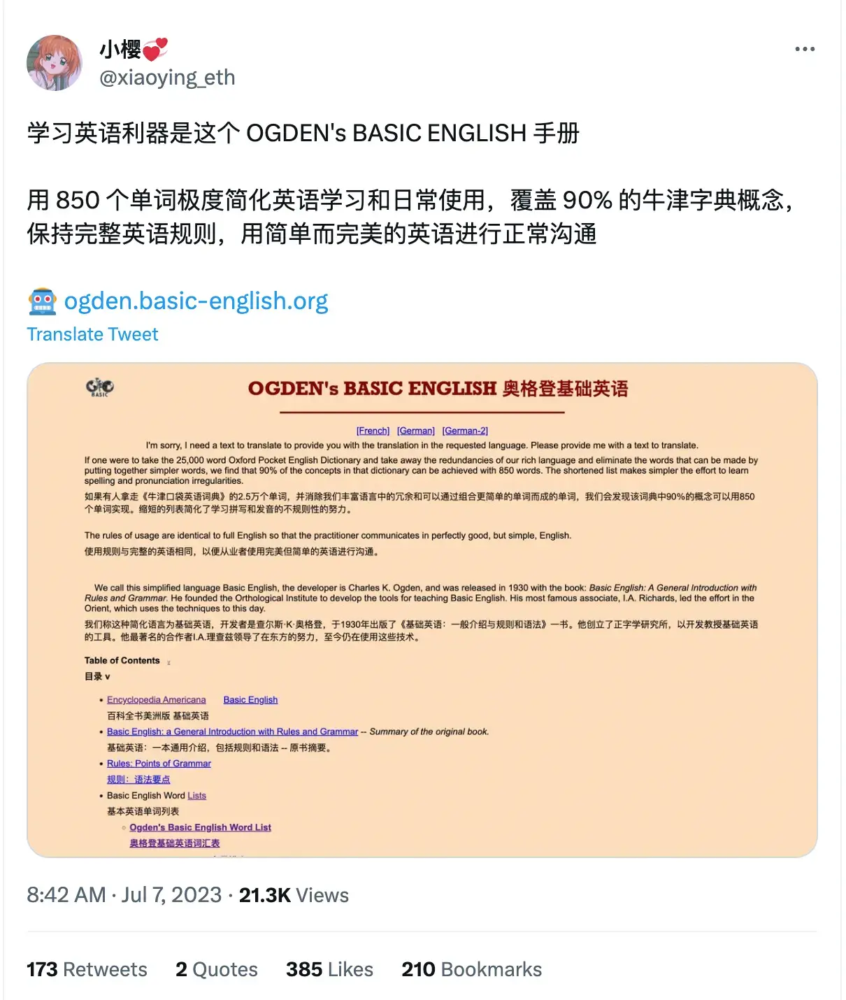

# BASIC-ENGLISH-VOCABULARY

学习英语利器是这个 OGDEN's BASIC ENGLISH 手册 用 850 个单词极度简化英语学习和日常使用，覆盖 90% 的牛津字典概念，保持完整英语规则，用简单而完美的英语进行正常沟通

 http://ogden.basic-english.org/words.html

使用GPT 生成 学习文本

> 使用 markdown 格式返回 参考 格式 参考 | 序号 | 单词 | 英式发音 | Emoji | 翻译 | 词性 | 使用频率 | 例句 | 例句翻译 | | ---- | ---- | -------- | ----- | ---- | ---- | -------- | ---- | ---- | -------- | | 1 | awake | /əˈweɪk/ | 😳☀️ | 醒着的 | 形容词 | ★★☆☆☆ | She lay awake all night, unable to sleep. | 她整夜都醒着，无法入睡。 |

### OPERATIONS - 100 words

- come, get, give, go, keep, let, make, put, seem, take, be, do, have, say, see, send, may, will,
  about, across, after, against, among, at, before, between, by, down, from, in, off, on, over, through, to, under, up, with,
  as, for, of, till, than,
  a , the, all, any, every, little, much, no, other, some, such, that, this, I , he, you, who,
  and, because, but, or, if, though, while, how, when, where, why,
  again, ever, far, forward, here, near, now, out, still, then, there, together, well,
  almost, enough, even, not, only, quite, so, very, tomorrow, yesterday,
  north, south, east, west, please, yes .
  
| 序号 | 单词 | 英式发音 | 美式发音 | Emoji | 翻译 | 词性 | 使用频率 | 例句 | 例句翻译 |
| ---- | ------- | -------- | -------- | ----- | ------ | ------ | -------- | ------------------------------------------------ | --------------------------------------------- |
| 1 | come | /kʌm/ | /kəm/ | 🚶‍♂️ | 来 | 动词 | ★★★★☆ | Please come to my house for dinner. | 请来我家吃晚饭。 |
| 2 | get | /ɡet/ | /gɛt/ | 🛒 | 得到 | 动词 | ★★★★☆ | I need to get some groceries from the store. | 我需要从商店买些杂货。 |
| 3 | give | /ɡɪv/ | /gɪv/ | 🎁 | 给予 | 动词 | ★★★☆☆ | She gave me a present on my birthday. | 她在我的生日上给了我一个礼物。 |
| 4 | go | /ɡəʊ/ | /goʊ/ | 🚶‍♀️ | 去 | 动词 | ★★★★☆ | Let's go for a walk in the park. | 我们去公园散步吧。 |
| 5 | keep | /kiːp/ | /kip/ | 🤲 | 保持 | 动词 | ★★★☆☆ | Please keep the door closed. | 请保持门关着。 |
| 6 | let | /let/ | /lɛt/ | 🙏 | 让 | 动词 | ★★★☆☆ | Can you let me borrow your pen? | 你可以借给我你的笔吗？ |
| 7 | make | /meɪk/ | /meɪk/ | 👷‍♂️ | 制造 | 动词 | ★★★★☆ | She made a delicious cake for the party. | 她为派对做了一个美味的蛋糕。 |
| 8 | put | /pʊt/ | /pʊt/ | 📦 | 放置 | 动词 | ★★★☆☆ | Put your shoes on the shoe rack, please. | 请把你的鞋子放在鞋架上。 |
| 9 | seem | /siːm/ | /sim/ | 🧐 | 似乎 | 动词 | ★★★☆☆ | He seems to be upset about something. | 他似乎对某事感到不快。 |
| 10 | take | /teɪk/ | /teɪk/ | 🤲 | 拿 | 动词 | ★★★★☆ | Take an umbrella with you. | 带一把伞走。 |
| 11 | be | /biː/ | /bi/ | 💭 | 是 | 动词 | ★★★★★ | I am happy to see you. | 见到你我很高兴。 |
| 12 | do | /duː/ | /du/ | ✅ | 做 | 动词 | ★★★★☆ | What do you want to do this weekend? | 这个周末你想做什么？ |
| 13 | have | /hæv/ | /hæv/ | 🈶 | 有 | 动词 | ★★★★☆ | She has a beautiful garden in her backyard. | 她后院有一个漂亮的花园。 |
| 14 | say | /seɪ/ | /seɪ/ | 🗣️ | 说 | 动词 | ★★★★☆ | Can you hear what I'm saying? | 你能听到我在说什么吗？ |
| 15 | see | /siː/ | /si/ | 👀 | 看见 | 动词 | ★★★★☆ | I saw a movie last night. | 昨晚我看了一部电影。 |
| 16 | send | /send/ | /sɛnd/ | 📤 | 发送 | 动词 | ★★★☆☆ | Please send me an email with the details. | 请给我发送一封包含详情的电子邮件。 |
| 17 | may | /meɪ/ | /meɪ/ | 🤔 | 可以 | 动词 | ★★☆☆☆ | May I ask you a question? | 我可以问你一个问题吗？ |
| 18 | will | /wɪl/ | /wɪl/ | 🌟 | 将会 | 动词 | ★★★☆☆ | I will meet you at the restaurant at 7 o'clock. | 我会在七点钟在餐厅见你。 |
| 19 | about | /əˈbaʊt/ | /əbaʊt/ | 🤔 | 关于 | 介词 | ★★★☆☆ | Let's talk about our plans for the weekend. | 让我们谈谈我们的周末计划。 |
| 20 | across | /əkrɒs/ | /əkɹɔs/ | 🚶‍♂️ | 横过 | 介词 | ★★★☆☆ | She walked across the bridge to get to the park. | 她横过桥去公园。 |
| 21 | after | /ɑːftə/ | /æftər/ | ⏰ | 之后 | 介词 | ★★★★☆ | We will meet for coffee after work. | 我们下班后会见面喝咖啡。 |
| 22 | against | /əɡenst/ | /əgɛnst/ | 🙅‍♀️ | 对抗 | 介词 | ★★★☆☆ | He leaned against the wall and closed his eyes. | 他靠在墙上闭上眼睛。 |
| 23 | among | /əmʌŋ/ | /əməŋ/ | 😄 | 在...中 | 介词 | ★★★☆☆ | There is a lot of diversity among the students. | 学生们之间有很多种类的差异。 |
| 24 | at | /ət/ | /æt/ | 📍 | 在 | 介词 | ★★★★★ | Meet me at the park at noon. | 中午在公园见我。 |
| 25 | before | /bɪfɔː/ | /bɪfɔɹ/ | ⏰ | 在之前 | 介词 | ★★★★☆ | Let's have a meeting before lunch. | 让我们在午餐前开个会。 |
| 26 | between | /bɪtwiːn/ | /bɪtwin/ | ↔️ | 在...之间 | 介词 | ★★★★☆ | The library is located between the school and the park. | 图书馆位于学校和公园之间。 |
| 27 | by | /baɪ/ | /baɪ/ | 📖 | 通过 | 介词 | ★★★☆☆ | You can reach me by phone or email. | 你可以通过电话或电子邮件联系到我。 |
| 28 | down | /daʊn/ | /daʊn/ | ⬇️ | 下 | 介词 | ★★★☆☆ | Please write your name down on the form. | 请在表格上写下你的名字。 |
| 29 | from | /frəm/ | /fɹəm/ | 🏡 | 来自 | 介词 | ★★★★☆ | I received a gift from my friend. | 我收到了一份来自朋友的礼物。 |
| 30 | in | /ɪn/ | /ɪn/ | 📌 | 在 | 介词 | ★★★★★ | The book is on the shelf in the living room. | 这本书在客厅的书架上。 |
| 31 | off | /ɒf/ | /ɔf/ | 📴 | 关闭 | 介词 | ★★★☆☆ | Please turn off the lights when you leave. | 你离开时请关灯。 |
| 32 | on | /ɒn/ | /ɑn/ | 🔛 | 开启 | 介词 | ★★★★☆ | Can you turn on the TV, please? | 请你打开电视好吗？ |
| 33 | over | /əʊvə/ | /oʊvər/ | 🔄 | 在...上 | 介词 | ★★★☆☆ | She placed a cloth over the table. | 她在桌子上铺了一块布。 |
| 34 | through | /θruː/ | /θɹu/ | ⤵️ | 通过 | 介词 | ★★★☆☆ | We walked through the park to get to the museum. | 我们穿过公园去博物馆。 |
| 35 | to | /tə/ | /tu/ | 🎯 | 到 | 介词 | ★★★★☆ | I need to go to the store to buy some groceries. | 我需要去商店买些杂货。 |
| 36 | under | /ʌndə/ | /əndər/ | 📦 | 在...下 | 介词 | ★★★☆☆ | The cat hid under the bed during the storm. | 猫在风暴期间躲在床底下。 |
| 37 | up | /ʌp/ | /əp/ | ⬆️ | 上 | 介词 | ★★★☆☆ | Please pick up your toys before leaving. | 离开前请捡起你的玩具。 |
| 38 | with | /wɪð/ | /wɪð/ | 👥 | 与 | 介词 | ★★★★☆ | I went to the concert with my friends. | 我和朋友一起去听音乐会。 |
| 39 | as | /əz/ | /æz/ | 🔄 | 如同 | 连词 | ★★★☆☆ | She sang beautifully, as always. | 她如往常一样唱得很美。 |
| 40 | for | /fə/ | /fɔɹ/ | 🎁 | 对于 | 介词 | ★★★★☆ | This gift is for you. | 这个礼物是给你的。 |
| 41 | of | /əv/ | /əv/ | 📚 | 的 | 介词 | ★★★★★ | The cover of the book is blue. | 这本书的封面是蓝色的。 |
| 42 | till | /tɪl/ | /tɪl/ | ⏰ | 直到 | 介词 | ★★★☆☆ | They worked from morning till night. | 他们从早到晚都在工作。 |
| 43 | than | /ðən/ | /ðæn/ | 🔄 | 比 | 介词 | ★★★☆☆ | She is taller than her sister. | 她比她妹妹高。 |
| 44 | a | /ə/ | /ə/ | 1️⃣ | 一个 | 冠词 | ★★★★★ | I need a pen to write the letter. | 我需要一支笔来写信。 |
| 45 | the | /ðə/ | /ðə/ | 📖 | 这个 | 冠词 | ★★★☆☆ | The cat is sleeping on the mat. | 猫正在垫子上睡觉。 |
| 46 | all | /ɔːl/ | /ɔl/ | 🌟 | 所有 | 代词 | ★★★★☆ | All students must attend the meeting. | 所有学生都必须参加会议。 |
| 47 | any | /eni/ | /ɛni/ | ❓ | 任何 | 代词 | ★★★☆☆ | Is there any milk in the fridge? | 冰箱里有牛奶吗？ |
| 48 | every | /evri/ | /ɛvəri/ | 🔁 | 每个 | 代词 | ★★★☆☆ | Every child deserves love and care. | 每个孩子都应该得到爱和关怀。 |
| 49 | little | /lɪtəl/ | /lɪtəl/ | 📏 | 少许 | 代词 | ★★☆☆☆ | Please give me a little more time to finish. | 请给我一点时间来完成。 |
| 50 | much | /mʌtʃ/ | /mətʃ/ | 👍 | 很多 | 代词 | ★★★☆☆ | Thank you very much for your help. | 非常感谢你的帮助。 |
| 51 | no | /nəʊ/ | /noʊ/ | ⛔️ | 没有 | 代词 | ★★★☆☆ | There is no water in the bottle. | 瓶子里没有水。 |
| 52 | other | /ʌðə/ | /əðər/ | ➕ | 其他 | 代词 | ★★★☆☆ | I have to finish this project before starting another one. | 我必须在开始新项目之前完成这个项目。 |
| 53 | some | /sʌm/ | /səm/ | 🤔🔹 | 一些 | 代词 | ★★★★☆ | Can I have some water, please? | 我可以请你给我一些水吗？ |
| 54 | such | /sʌtʃ/ | /sətʃ/ | 😮🔹 | 这样的 | 形容词 | ★★★☆☆ | It was such a beautiful sunset. | 那是一场如此美丽的日落。 |
| 55 | that | /ðæt/ | /ðæt/ | 😐🔹 | 那 | 代词 | ★★★★★ | The book that I borrowed is on the table. | 我借的那本书在桌子上。 |
| 56 | this | /ðɪs/ | /ðɪs/ | 😊🔹 | 这 | 代词 | ★★★★★ | This is my favorite song. | 这是我最喜欢的歌曲。 |
| 57 | I | /aɪ/ | /aɪ/ | 😄🔸 | 我 | 代词 | ★★★★★ | I love to read books. | 我喜欢阅读书籍。 |
| 58 | he | /hiː/ | /hi/ | 👨🔸 | 他 | 代词 | ★★★★☆ | He is my best friend. | 他是我最好的朋友。 |
| 59 | you | /juː/ | /ju/ | 😊🔸 | 你 | 代词 | ★★★★★ | Can you help me with my homework? | 你能帮我做作业吗？ |
| 60 | who | /huː/ | /hu/ | 🤔🔹 | 谁 | 代词 | ★★★★☆ | Who is that girl over there? | 那边那个女孩是谁？ |
| 61 | and | /ənd/ | /ənd/ | ➕🔹 | 和 | 连词 | ★★★★★ | I like to read and write. | 我喜欢阅读和写作。 |
| 62 | because | /bɪkɒz/ | /bɪkɔz/ | 🤔🔸 | 因为 | 连词 | ★★★★☆ | I didn't go to the party because I was tired. | 我没去参加聚会，因为我累了。 |
| 63 | but | /bʌt/ | /bət/ | 😐🔸 | 但是 | 连词 | ★★★★☆ | I want to go, but I don't have time. | 我想去，但我没有时间。 |
| 64 | or | /ɔː/ | /ɔɹ/ | 🤔🔸 | 或者 | 连词 | ★★★★☆ | Would you like tea or coffee? | 你想要茶还是咖啡？ |
| 65 | if | /ɪf/ | /ɪf/ | 🤔🔸 | 如果 | 连词 | ★★★★★ | If it rains, we will stay indoors. | 如果下雨，我们会呆在室内。 |
| 66 | though | /ðəʊ/ | /ðoʊ/ | 😐🔹 | 虽然 | 连词 | ★★★☆☆ | Though he was tired, he kept working. | 虽然他累了，他还是继续工作。 |
| 67 | while | /waɪl/ | /waɪl/ | 🤔🔸 | 当 | 连词 | ★★★★☆ | I like to listen to music while I study. | 我喜欢一边学习一边听音乐。 |
| 68 | how | /haʊ/ | /haʊ/ | 😮🔹 | 如何 | 副词 | ★★★☆☆ | How did you solve the problem? | 你是如何解决这个问题的？ |
| 69 | when | /wen/ | /wɛn/ | 🤔🔸 | 什么时候 | 副词 | ★★★★★ | When will you arrive at the airport? | 你什么时候到达机场？ |
| 70 | where | /weə/ | /wɛɹ/ | 🤔🔸 | 在哪里 | 副词 | ★★★★☆ | Where is the nearest supermarket? | 最近的超市在哪里？ |
| 71 | why | /waɪ/ | /waɪ/ | 🤔🔸 | 为什么 | 副词 | ★★★★☆ | Why are you crying? | 你为什么在哭？ |
| 72 | again | /əˈɡen/ | /əgɛn/ | 😊🔹 | 再次 | 副词 | ★★★☆☆ | Let's try again. | 让我们再试一次。 |
| 73 | ever | /evə/ | /ɛvər/ | 🤔🔹 | 曾经 | 副词 | ★★★☆☆ | Have you ever been to Paris? | 你曾经去过巴黎吗？ |
| 74 | far | /fɑː/ | /fɑɹ/ | 😊🔹 | 远 | 副词 | ★★★☆☆ | The school is not far from here. | 学校离这里不远。 |
| 75 | forward | /fɔːwəd/ | /fɔɹwərd/ | 😊🔹 | 向前 | 副词 | ★★★☆☆ | We need to move forward and find a solution. | 我们需要向前迈进并找到解决办法。 |
| 76 | here | /hɪə/ | /hiɹ/ | 😊🔹 | 这里 | 副词 | ★★★★☆ | I will meet you here at 7 PM. | 我会在晚上7点在这里见你。 |
| 77 | near | /nɪə/ | /nɪɹ/ | 😊🔹 | 附近 | 副词 | ★★★★☆ | There is a park near our house. | 我们家附近有一个公园。 |
| 78 | now | /naʊ/ | /naʊ/ | 😊🔹 | 现在 | 副词 | ★★★★★ | I am busy right now. | 我现在很忙。 |
| 79 | out | /aʊt/ | /aʊt/ | 😊🔹 | 外面 | 副词 | ★★★☆☆ | Let's go out for a walk. | 让我们出去散步一下。 |
| 80 | still | /stɪl/ | /stɪl/ | 😐🔹 | 仍然 | 副词 | ★★★☆☆ | She is still waiting for the bus. | 她仍在等待公交车。 |
| 81 | then | /ðen/ | /ðɛn/ | 😊🔹 | 然后 | 副词 | ★★★★☆ | First, we eat breakfast. Then, we go to work. | 首先，我们吃早餐。然后，我们去上班。 |
| 82 | there | /ðeə/ | /ðɛɹ/ | 😊🔹 | 那里 | 副词 | ★★★★☆ | The keys are over there on the table. | 钥匙在那边的桌子上。 |
| 83 | together | /təɡeðə/ | /təgɛðər/ | 😊🔹 | 在一起 | 副词 | ★★★★☆ | Let's go watch a movie together. | 让我们一起去看电影吧。 |
| 84 | well | /wel/ | /wɛl/ | 😊🔹 | 好 | 副词 | ★★★☆☆ | She speaks English very well. | 她英语说得很好。 |
| 85 | almost | /ɔːlməʊst/ | /ɔlmoʊst/ | 😐🔹 | 几乎 | 副词 | ★★★★☆ | The cake is almost finished. | 蛋糕几乎吃完了。 |
| 86 | enough | /ɪnʌf/ | /ɪnəf/ | 😐🔹 | 足够 | 副词 | ★★★★☆ | I have had enough to eat. | 我吃饱了。 |
| 87 | even | /iːvən/ | /ivɪn/ | 😐🔹 | 甚至 | 副词 | ★★★★☆ | He didn't even apologize for his mistake. | 他甚至没有为他的错误道歉。 |
| 88 | not | /nɒt/ | /nɑt/ | 🙅🔹 | 不 | 副词 | ★★★★★ | I am not going to the party tonight. | 今晚我不去参加聚会。 |
| 89 | only | /əʊnli/ | /oʊnli/ | 😐🔹 | 只有 | 副词 | ★★★★☆ | She is the only person I trust. | 她是我唯一信任的人。 |
| 90 | quite | /kwaɪt/ | /kwaɪt/ | 😊🔹 | 相当 | 副词 | ★★★★☆ | The movie was quite interesting. | 这电影相当有趣。 |
| 91 | so | /səʊ/ | /soʊ/ | 😊🔸 | 如此 | 副词 | ★★★★☆ | The weather is so nice today. | 今天的天气真好。 |
| 92 | very | /veri/ | /vɛɹi/ | 😊🔸 | 非常 | 副词 | ★★★★★ | She is very talented. | 她非常有天赋。 |
| 93 | tomorrow | /təmɒrəʊ/ | /təmɑɹoʊ/ | 😊🔹 | 明天 | 副词 | ★★★★☆ | I have a meeting tomorrow morning. | 明天早上我有一个会议。 |
| 94 | yesterday | /jestədeɪ/ | /jɛstərdeɪ/ | 😊🔹 | 昨天 | 副词 | ★★★★☆ | We went to the beach yesterday. | 我们昨天去了海滩。 |
| 95 | north | /nɔːθ/ | /nɔɹθ/ | 🧭🔹 | 北方 | 名词 | ★★★☆☆ | The mountain range is to the north. | 山脉在北方。 |
| 96 | south | /saʊθ/ | /saʊθ/ | 🧭🔹 | 南方 | 名词 | ★★★☆☆ | They live in the south of the country. | 他们住在南方国家。 |
| 97 | east | /iːst/ | /ist/ | 🧭🔹 | 东方 | 名词 | ★★★☆☆ | The sun rises in the east. | 太阳从东方升起。 |
| 98 | west | /west/ | /wɛst/ | 🧭🔹 | 西方 | 名词 | ★★★☆☆ | The beach is to the west of the city. | 海滩在城市的西方。 |
| 99 | please | /pliːz/ | /pliz/ | 🙏🔹 | 请 | 动词 | ★★★★☆ | Can you please pass me the salt? | 你能请递给我盐吗？ |
| 100 | yes | /jes/ | /jɛs/ | ✅🔹 | 是 | 动词 | ★★★★★ | Yes, I would like to order a pizza. | 是的，我想订购一份比萨饼。 |

### THINGS - 400 General words
- [ ] TODO 待生成

- account, act, addition, adjustment, advertisement, agreement, air, amount, amusement, animal, answer, apparatus, approval, argument, art, attack, attempt, attention, attraction, authority,
-  back, balance, base, behavior, belief, birth, bit, bite, blood, blow, body, brass, bread, breath, brother, building, burn, burst, business, butter, 
- canvas, care, cause, chalk, chance, change, cloth, coal, color, comfort, committee, company, comparison, competition, condition, connection, control, cook, copper, copy, cork, cotton, cough, country, cover, crack, credit, crime, crush, cry, current, curve, 
- damage, danger, daughter, day, death, debt, decision, degree, design, desire, destruction, detail, development, digestion, direction, discovery, discussion, disease, disgust, distance, distribution, division, doubt, drink, driving, dust,
-  earth, edge, education, effect, end, error, event, example, exchange, existence, expansion, experience, expert, 
- fact, fall, family, father, fear, feeling, fiction, field, fight, fire, flame, flight, flower, fold, food, force, form, friend, front, fruit, 
- glass, gold, government, grain, grass, grip, group, growth, guide, 
- harbor, harmony, hate, hearing, heat, help, history, hole, hope, hour, humor,
-  ice, idea, impulse, increase, industry, ink, insect, instrument, insurance, interest, invention, iron, 
- jelly, join, journey, judge, jump, 
- kick, kiss, knowledge,
-  land, language, laugh, law, lead, learning, leather, letter, level, lift, light, limit, linen, liquid, list, look, loss, love, 
- machine, man, manager, mark, market, mass, meal, measure, meat, meeting, memory, metal, middle, milk, mind, mine, minute, mist, money, month, morning ,mother, motion, mountain, move, music,
-  name, nation, need, news, night, noise, note, number,
-  observation, offer, oil, operation, opinion, order, organization, ornament, owner,
-  page, pain, paint, paper, part, paste, payment, peace, person, place, plant, play, pleasure, point, poison, polish, porter, position, powder, power, price, print, process, produce, profit, property, prose, protest, pull, punishment, purpose, push, 
- quality, question, 
- rain, range, rate, ray, reaction, reading, reason, record, regret, relation, religion, representative, request, respect, rest, reward, rhythm, rice, river, road, roll, room, rub, rule, run, 
- salt, sand, scale, science, sea, seat, secretary, selection, self, sense, servant, sex, shade, shake, shame, shock, side, sign, silk, silver, sister, size, sky, sleep, slip, slope, smash, smell, smile, smoke, sneeze, snow, soap, society, son, song, sort, sound, soup, space, stage, start, statement, steam, steel, step, stitch, stone, stop, story, stretch, structure, substance, sugar, suggestion, summer, support, surprise, swim, system,
-  talk, taste, tax, teaching, tendency, test, theory, thing, thought, thunder, time, tin, top, touch, trade, transport, trick, trouble, turn, twist, 
- unit, use, 
- value, verse, vessel, view, voice,
-  walk, war, wash, waste, water, wave, wax, way, weather, week, weight, wind, wine, winter, woman, wood, wool, word, work, wound, writing ,
-  year .

| 序号 | 单词 | 英式发音 | 美式发音 | Emoji | 翻译 | 词性 | 使用频率 | 例句 | 例句翻译 |
| ---- | ------------- | ----- | -------- | ---- | --------- | -------- | ----------- | ------------------------------------ | ------------------------------------ |
| 1 | account | /əkaʊnt/ | /əkaʊnt/ | 📄💼 | 账户 | 名词 | ★★★★☆ | I need to check my bank account. | 我需要查看一下我的银行账户。 |
| 2 | act | /ækt/ | /ækt/ | 🎭🎬 | 行为 | 名词/动词 | ★★★☆☆ | The police arrived quickly and acted without hesitation. | 警察很快赶到并且毫不犹豫地采取行动。 |
| 3 | addition | /ədɪʃən/ | /ədɪʃən/ | ➕ | 增加 | 名词 | ★★☆☆☆ | In addition to English, he can also speak French. | 除了英语，他还会说法语。 |
| 4 | adjustment | /əʤəstmənt/ | /ədʒəstmənt/ | 🔧⚙️ | 调整 | 名词 | ★★☆☆☆ | The engineer made some adjustments to the machine. | 工程师对机器进行了一些调整。 |
| 5 | advertisement | /ædvərtaɪzmənt/ | /ədvərtəzmənt/ | 📺📰 | 广告 | 名词 | ★★★☆☆ | The company placed an advertisement in the newspaper. | 公司在报纸上刊登了一则广告。 |
| 6 | agreement | /əgrimənt/ | /əgɹimənt/ | ✍️🤝 | 协议 | 名词 | ★★★☆☆ | They reached an agreement on the terms of the contract. | 他们就合同条款达成了一致。 |
| 7 | air | /ɛr/ | /ɛɹ/ | 💨 | 空气 | 名词 | ★★★★☆ | The air in the mountains is fresh and clean. | 山里的空气清新而干净。 |
| 8 | amount | /əmaʊnt/ | /əmaʊnt/ | 📈💰 | 数量 | 名词/动词 | ★★★☆☆ | She spent a large amount of money on clothes. | 她在衣服上花了大量的钱。 |
| 9 | amusement | /əmjuzmənt/ | /əmjuzmənt/ | 🎢🎡 | 娱乐 | 名词 | ★★☆☆☆ | The theme park offers a variety of amusements for visitors. | 这个主题公园为游客提供各种娱乐项目。 |
| 10 | animal | /ænəməl/ | /ænəməl/ | 🐱🐶 | 动物 | 名词 | ★★★★☆ | Tigers are wild animals found in Asia. | 老虎是发现在亚洲的野生动物。 |
| 11 | answer | /ˈɑːnsə/ | /ænsər/ | ✍️❓ | 回答 | 名词/动词 | ★★★☆☆ | She asked a question, but he didn't know the answer. | 她问了一个问题，但他不知道答案。 |
| 12 | ant | /ænt/ | /ænt/ | 🐜 | 蚂蚁 | 名词 | ★★☆☆☆ | Ants are small insects that live in colonies. | 蚂蚁是生活在群落中的小昆虫。 |
| 13 | apartment | /əˈpɑːtmənt/ | /əpɑɹtmənt/ | 🏢🏠 | 公寓 | 名词 | ★★★☆☆ | She lives in a small apartment in the city. | 她住在城市里的一套小公寓里。 |
| 14 | apple | /æpəl/ | /æpəl/ | 🍎 | 苹果 | 名词 | ★★★★☆ | I like to eat a juicy apple for a snack. | 我喜欢吃一个多汁的苹果作为零食。 |
| 15 | appointment | /əpɔɪntmənt/ | /əpɔɪntmənt/ | 📅🕰️ | 约会 | 名词 | ★★★☆☆ | I have an appointment with the doctor tomorrow. | 我明天有一个和医生的约会。 |
| 16 | approval | /əpruvəl/ | /əpɹuvəl/ | 👍✅ | 批准 | 名词 | ★★☆☆☆ | The project received the manager's approval. | 这个项目得到了经理的批准。 |
| 17 | area | /ɛriə/ | /ɛɹiə/ | 📍🗺️ | 区域 | 名词 | ★★★★☆ | This park covers a large area of land. | 这个公园占地面积很大。 |
| 18 | argument | /ɑrgjəmənt/ | /ɑɹgjəmənt/ | 🗣️🤬 | 争论 | 名词 | ★★★☆☆ | They had a heated argument about politics. | 他们就政治问题进行了激烈的争论。 |
| 19 | arm | /ɑːm/ | /ɑɹm/ | 💪🦾 | 手臂 | 名词 | ★★★☆☆ | He injured his arm while playing sports. | 他在运动中受伤了他的手臂。 |
| 20 | art | /ɑrt/ | /ɑɹt/ | 🎨🖌️ | 艺术 | 名词 | ★★★☆☆ | She has a great talent for art. | 她在艺术方面非常有天赋。 |
| 21 | article | /ˈɑːtɪkəl/ | /ɑɹtəkəl/ | 📰🗞️ | 文章 | 名词 | ★★★☆☆ | I read an interesting article in the newspaper. | 我在报纸上读了一篇有趣的文章。 |
| 22 | ash | /æʃ/ | /æʃ/ | 🌫️🌳 | 灰烬 | 名词 | ★★☆☆☆ | The fire left only ashes behind. | 火灾只留下了灰烬。 |
| 23 | ask | /ɑːsk/ | /æsk/ | ❓🗣️ | 问 | 动词 | ★★★★☆ | Can I ask you a question? | 我可以问你一个问题吗？ |
| 24 | attack | /ətæk/ | /ətæk/ | ⚔️😱 | 攻击 | 名词/动词 | ★★★☆☆ | The soldiers launched a surprise attack on the enemy. | 士兵们对敌人发起了突袭。 |
| 25 | attention | /ətɛnʃən/ | /ətɛnʃən/ | 👀🧠 | 注意 | 名词 | ★★★★☆ | Please pay attention to the following instructions. | 请注意以下说明。 |
| 26 | attraction | /ətrækʃən/ | /ətɹækʃən/ | ⛲🎡 | 景点 | 名词 | ★★★☆☆ | The Eiffel Tower is a popular attraction in Paris. | 埃菲尔铁塔是巴黎的一个热门景点。 |
| 27 | aunt | /ɑːnt/ | /ænt/ | 👩‍🦱👩‍❤️ | 姑妈 | 名词 | ★★★☆☆ | My aunt is coming to visit us this weekend. | 我的姑妈这个周末要来看我们。 |
| 28 | autumn | /ˈɔːtəm/ | /ɔtəm/ | 🍂🍁 | 秋天 | 名词 | ★★★☆☆ | The leaves turn red in autumn. | 叶子在秋天变红。 |
| 29 | baby | /beɪbi/ | /beɪbi/ | 👶🍼 | 婴儿 | 名词 | ★★★★☆ | She just had a beautiful baby girl. | 她刚生了一个漂亮的女婴。 |
| 30 | back | /bæk/ | /bæk/ | 🔙⬅️ | 背部 | 名词/副词 | ★★★★☆ | He carried the backpack on his back. | 他背着背包。 |
| 31 | bag | /bæg/ | /bæg/ | 🎒👜 | 袋子 | 名词 | ★★★★☆ | She put her books in the bag and left the classroom. | 她把书放进袋子里离开了教室。 |
| 32 | bake | /beɪk/ | /beɪk/ | 🍞👩‍🍳 | 烘焙 | 动词 | ★★☆☆☆ | She likes to bake cookies for her friends. | 她喜欢为她的朋友烤饼干。 |
| 33 | balance | /bæləns/ | /bæləns/ | ⚖️⚖️ | 平衡 | 名词/动词 | ★★★☆☆ | She tried to balance on one foot. | 她试图一只脚保持平衡。 |
| 34 | ball | /bɔl/ | /bɔl/ | ⚽🏀 | 球 | 名词 | ★★★★☆ | We played a game of soccer with a ball. | 我们用足球玩了一场比赛。 |
| 35 | banana | /bənænə/ | /bənænə/ | 🍌 | 香蕉 | 名词 | ★★★☆☆ | He ate a ripe banana for breakfast. | 他早餐吃了一个熟透的香蕉。 |
| 36 | band | /bænd/ | /bænd/ | 🎵🎸 | 乐队 | 名词 | ★★★☆☆ | The band performed at the music festival. | 乐队在音乐节上演出。 |
| 37 | bank | /bæŋk/ | /bæŋk/ | 🏦💰 | 银行 | 名词 | ★★★☆☆ | I need to deposit some money in the bank. | 我需要把一些钱存进银行。 |
| 38 | bar | /bɑr/ | /bɑɹ/ | 🍻🍹 | 酒吧 | 名词 | ★★★☆☆ | They met at a local bar for drinks. | 他们在当地的酒吧喝酒碰面。 |
| 39 | baseball | /beɪsbɔl/ | /beɪsbɔl/ | ⚾️⚾️ | 棒球 | 名词 | ★★★☆☆ | He enjoys playing baseball with his friends. | 他喜欢和朋友一起打棒球。 |
| 40 | basket | /bæskət/ | /bæskət/ | 🧺 | 篮子 | 名词 | ★★★☆☆ | She carried a basket of fruits to the picnic. | 她提着一筐水果去野餐。 |
| 41 | bathroom | /bæθrum/ | /bæθɹum/ | 🛁🚽 | 浴室 | 名词 | ★★★☆☆ | The bathroom is next to the bedroom. | 浴室在卧室旁边。 |
| 42 | beach | /biʧ/ | /bitʃ/ | 🏖️🌊 | 海滩 | 名词 | ★★★★☆ | They enjoyed a day at the beach. | 他们在海滩度过了一天的时光。 |
| 43 | bear | /bɛr/ | /bɛɹ/ | 🐻 | 熊 | 名词/动词 | ★★★☆☆ | Bears are large and powerful animals. | 熊是又大又强壮的动物。 |
| 44 | beautiful | /bjutəfəl/ | /bjutəfəl/ | 😍🌟 | 美丽 | 形容词 | ★★★★☆ | She wore a beautiful dress to the party. | 她穿了一条漂亮的裙子去参加派对。 |
| 45 | bed | /bɛd/ | /bɛd/ | 🛏️🛌 | 床 | 名词 | ★★★★☆ | I'm going to lie down on the bed and rest. | 我要躺在床上休息一下。 |
| 46 | bedroom | /bɛdrum/ | /bɛdɹum/ | 🛏️🚪 | 卧室 | 名词 | ★★★☆☆ | The bedroom is upstairs on the left. | 卧室在楼上的左边。 |
| 47 | bee | /bi/ | /bi/ | 🐝 | 蜜蜂 | 名词 | ★★★☆☆ | Bees collect nectar from flowers to make honey. | 蜜蜂从花朵中采集花蜜制作蜂蜜。 |
| 48 | before | /bifɔr/ | /bɪfɔɹ/ | ⏮️⏰ | 之前 | 副词 | ★★★★☆ | Please arrive 10 minutes before the meeting starts. | 请提前10分钟到达会议开始的时间。 |
| 49 | begin | /bɪgɪn/ | /bɪgɪn/ | 🆕▶️ | 开始 | 动词 | ★★★★☆ | The movie will begin in five minutes. | 电影将在五分钟后开始。 |
| 50 | bell | /bɛl/ | /bɛl/ | 🔔🛎️ | 铃铛 | 名词 | ★★★☆☆ | The teacher rang the bell to signal the end of class. | 老师按响了铃铛，表示下课了。 |
| 61 | bicycle | /baɪsɪkəl/ | /baɪsɪkəl/ | 🚲 | 自行车 | 名词 | ★★★★☆ | She rides her bicycle to work every day. | 她每天骑自行车上班。 |
| 62 | big | /bɪg/ | /bɪg/ | 🐘 | 大的 | 形容词 | ★★★★☆ | They live in a big house with a garden. | 他们住在一栋带花园的大房子里。 |
| 63 | bird | /bərd/ | /bərd/ | 🐦 | 鸟 | 名词 | ★★★★☆ | The bird is singing in the tree. | 那只鸟在树上唱歌。 |
| 64 | birthday | /bərθdeɪ/ | /bərθdeɪ/ | 🎂🎉 | 生日 | 名词 | ★★★★☆ | We celebrated her birthday with a party. | 我们用一个聚会来庆祝她的生日。 |
| 65 | black | /blæk/ | /blæk/ | ⚫🖤 | 黑色 | 形容词 | ★★★★☆ | She wore a black dress to the funeral. | 她穿了一条黑色的裙子去参加葬礼。 |
| 66 | blanket | /blæŋkɪt/ | /blæŋkət/ | 🛏️👵 | 毛毯 | 名词 | ★★★☆☆ | She covered herself with a warm blanket. | 她用一条温暖的毛毯盖住自己。 |
| 67 | blue | /blu/ | /blu/ | 💙🌊 | 蓝色 | 形容词 | ★★★★☆ | The sky is blue on a sunny day. | 晴天时天空是蓝色的。 |
| 68 | boat | /boʊt/ | /boʊt/ | ⛵🌊 | 船 | 名词 | ★★★★☆ | They went fishing on a small boat. | 他们乘小船去钓鱼。 |
| 69 | body | /bɑdi/ | /bɑdi/ | 👤💪 | 身体 | 名词 | ★★★★☆ | Regular exercise is good for your body. | 定期锻炼对身体有好处。 |
| 70 | book | /bʊk/ | /bʊk/ | 📚📖 | 书 | 名词 | ★★★★☆ | She enjoys reading books in her free time. | 她喜欢在空闲时间阅读书籍。 |
| 71 | bottle | /bɑtəl/ | /bɑtəl/ | 🍾🍼 | 瓶子 | 名词 | ★★★★☆ | He drank water from a plastic bottle. | 他从一个塑料瓶子里喝水。 |
| 72 | box | /bɑks/ | /bɑks/ | 📦👝 | 盒子 | 名词 | ★★★★☆ | She packed her belongings into a cardboard box. | 她把她的物品装进了一个纸箱里。 |
| 73 | boy | /bɔɪ/ | /bɔɪ/ | 👦🤗 | 男孩 | 名词 | ★★★★☆ | The little boy is playing with his toy car. | 那个小男孩正在玩他的玩具车。 |
| 74 | bread | /brɛd/ | /bɹɛd/ | 🍞 | 面包 | 名词 | ★★★★☆ | She bought a loaf of bread from the bakery. | 她从面包店买了一条面包。 |
| 75 | break | /breɪk/ | /bɹeɪk/ | ☕↔️ | 休息 | 名词/动词 | ★★★☆☆ | Let's take a break and have a cup of coffee. | 让我们休息一下，喝杯咖啡。 |
| 76 | breakfast | /brɛkfəst/ | /bɹɛkfəst/ | 🍳🥐 | 早餐 | 名词 | ★★★★☆ | He had scrambled eggs for breakfast. | 他早餐吃了炒鸡蛋。 |
| 77 | bridge | /brɪʤ/ | /bɹɪdʒ/ | 🌉🚗 | 桥 | 名词 | ★★★★☆ | They drove across the bridge to get to the other side. | 他们开车穿过桥来到另一边。 |
| 78 | bright | /braɪt/ | /bɹaɪt/ | ☀️💡 | 明亮 | 形容词 | ★★★☆☆ | The sun is shining bright in the sky. | 太阳在天空中照得很明亮。 |
| 79 | bring | /brɪŋ/ | /bɹɪŋ/ | 🏞️📤 | 带来 | 动词 | ★★★★☆ | Don't forget to bring your passport when you travel. | 在旅行时不要忘记带上你的护照。 |
| 80 | brother | /brəðər/ | /bɹəðər/ | 👦👧❤️ | 兄弟 | 名词 | ★★★★☆ | He has a younger brother and an older sister. | 他有一个弟弟和一个姐姐。 |
| 81 | brown | /braʊn/ | /bɹaʊn/ | 🌰 | 棕色 | 形容词 | ★★★★☆ | She has long, brown hair and green eyes. | 她有长长的棕色头发和绿色的眼睛。 |
| 82 | bus | /bəs/ | /bəs/ | 🚌🚍 | 公交车 | 名词 | ★★★★☆ | We take the bus to school every day. | 我们每天坐公交车去学校。 |
| 83 | business | /bɪznɪs/ | /bɪznəs/ | 💼💵 | 生意 | 名词 | ★★★★☆ | He runs his own business and is very successful. | 他经营自己的生意，非常成功。 |
| 84 | busy | /bɪzi/ | /bɪzi/ | ⏰📝 | 忙碌 | 形容词 | ★★★★☆ | She is always busy with work and has no free time. | 她总是忙于工作，没有空闲时间。 |
| 85 | buy | /baɪ/ | /baɪ/ | 💰🛒 | 购买 | 动词 | ★★★★☆ | I need to buy some groceries from the supermarket. | 我需要从超市购买一些杂货。 |
| 86 | cake | /keɪk/ | /keɪk/ | 🍰🎂 | 蛋糕 | 名词 | ★★★★☆ | She baked a delicious chocolate cake for her birthday. | 她为了生日烤了一个美味的巧克力蛋糕。 |
| 87 | camera | /kæmərə/ | /kæmərə/ | 📷📸 | 相机 | 名词 | ★★★★☆ | He loves taking photos with his new camera. | 他喜欢用他的新相机拍照。 |
| 88 | camp | /kæmp/ | /kæmp/ | ⛺️🌳 | 露营 | 名词/动词 | ★★★☆☆ | We went camping in the mountains last summer. | 我们去年夏天在山区露营。 |
| 89 | can | /kən/ | /kæn/ | 🥫🥤 | 可以 | 动词 | ★★★★☆ | Can you pass me the salt, please? | 请你把盐递给我好吗？ |
| 90 | candle | /kændəl/ | /kændəl/ | 🕯️🔥 | 蜡烛 | 名词 | ★★★☆☆ | They lit a candle to create a romantic atmosphere. | 他们点燃了一支蜡烛，营造浪漫的氛围。 |
| 91 | candy | /kændi/ | /kændi/ | 🍬🍭 | 糖果 | 名词 | ★★★★☆ | She gave me a piece of candy as a gift. | 她给了我一颗糖果作为礼物。 |
| 92 | cap | /kæp/ | /kæp/ | 🧢 | 帽子 | 名词 | ★★★☆☆ | He wore a baseball cap to protect himself from the sun. | 他戴着一顶棒球帽，以防晒伤。 |
| 93 | car | /kɑr/ | /kɑɹ/ | 🚗🚕 | 汽车 | 名词 | ★★★★☆ | They drove their car to the beach for a weekend getaway. | 他们开车去海滩度过一个周末。 |
| 94 | card | /kɑrd/ | /kɑɹd/ | 🃏💳 | 卡片 | 名词 | ★★★★☆ | She received a birthday card in the mail. | 她收到了一张生日卡片。 |
| 95 | careful | /kɛrfəl/ | /kɛɹfəl/ | ⚠️👀 | 小心 | 形容词 | ★★★☆☆ | Be careful when you cross the street. | 过马路时要小心。 |
| 96 | cat | /kæt/ | /kæt/ | 🐱😺 | 猫 | 名词 | ★★★★☆ | The cat is playing with a ball of yarn. | 那只猫正在玩一团毛线球。 |
| 97 | catch | /kæʧ/ | /kætʃ/ | 🎣🏈 | 捉住 | 动词 | ★★★☆☆ | He tried to catch the ball, but it slipped through his fingers. | 他试图接住球，但它从他手指间滑过。 |
| 98 | celebrate | /sɛləbreɪt/ | /sɛləbɹeɪt/ | 🎉🎊 | 庆祝 | 动词 | ★★★★☆ | We will celebrate New Year's Eve with a big party. | 我们将用一个大型派对庆祝除夕。 |
| 99 | chair | /ʧɛr/ | /tʃɛɹ/ | 🪑💺 | 椅子 | 名词 | ★★★★☆ | She sat down on the comfortable chair in the living room. | 她坐在客厅里舒适的椅子上。 |
| 100 | change | /ʧeɪnʤ/ | /tʃeɪndʒ/ | 💰🔄 | 改变 | 名词/动词 | ★★★★☆ | It's time for a change in my life. | 我的生活需要改变了。 |
| 101 | character | /kɛrɪktər/ | /kɛɹɪktər/ | 📚🎭 | 角色 | 名词 | ★★★☆☆ | He played the main character in the movie. | 他在电影中扮演了主角。 |
| 102 | cheap | /ʧip/ | /tʃip/ | 💰💲 | 廉价的 | 形容词 | ★★★☆☆ | She found a cheap flight to Europe. | 她找到了一趟去欧洲的廉价航班。 |
| 103 | check | /ʧɛk/ | /tʃɛk/ | ✅🔍 | 检查 | 动词 | ★★★★☆ | Don't forget to check your email for updates. | 不要忘记检查邮件以获取更新。 |
| 104 | cheese | /ʧiz/ | /tʃiz/ | 🧀🥪 | 奶酪 | 名词 | ★★★☆☆ | He likes to eat cheese with crackers. | 他喜欢用饼干搭配奶酪食用。 |
| 105 | chef | /ʃɛf/ | /ʃɛf/ | 👨‍🍳🍽️ | 厨师 | 名词 | ★★★☆☆ | The chef prepared a delicious meal for us. | 厨师为我们准备了一顿美味的饭菜。 |
| 106 | chicken | /ʧɪkən/ | /tʃɪkən/ | 🐔🍗 | 鸡肉 | 名词 | ★★★★☆ | She cooked chicken for dinner tonight. | 她今晚做了炸鸡来吃晚餐。 |
| 107 | child | /ʧaɪld/ | /tʃaɪld/ | 👶🧒 | 孩子 | 名词 | ★★★★☆ | The children are playing in the park. | 孩子们在公园里玩耍。 |
| 108 | chocolate | /ʧɔklət/ | /tʃɔklət/ | 🍫🍩 | 巧克力 | 名词 | ★★★★☆ | I bought a box of chocolates for my friend's birthday. | 我为我朋友的生日买了一盒巧克力。 |
| 109 | church | /ʧərʧ/ | /tʃərtʃ/ | ⛪️🙏 | 教堂 | 名词 | ★★★★☆ | They go to church every Sunday. | 他们每个星期天去教堂。 |
| 110 | cinema | /sɪnəmə/ | /sɪnəmə/ | 🎦🎥 | 电影院 | 名词 | ★★★☆☆ | Let's go to the cinema and watch a movie. | 我们去电影院看电影吧。 |
| 111 | city | /sɪti/ | /sɪti/ | 🌆🏙️ | 城市 | 名词 | ★★★★☆ | New York City is known as "The Big Apple". | 纽约市被誉为“大苹果”。 |
| 112 | class | /klæs/ | /klæs/ | 🏫📚 | 班级 | 名词 | ★★★☆☆ | She is in the same class as me. | 她和我在同一个班级。 |
| 113 | clean | /klin/ | /klin/ | 🧹🧼 | 清洁 | 形容词 | ★★★★☆ | Please keep your room clean and tidy. | 请保持你的房间干净整洁。 |
| 114 | clear | /klɪr/ | /klɪɹ/ | 🌞🌈 | 清晰的 | 形容词 | ★★★★☆ | The sky is clear today with no clouds. | 今天天空晴朗，没有云。 |
| 115 | climb | /klaɪm/ | /klaɪm/ | 🧗‍♀️⛰️ | 攀爬 | 动词 | ★★★☆☆ | They decided to climb Mount Everest. | 他们决定攀登珠穆朗玛峰。 |
| 116 | clock | /klɑk/ | /klɑk/ | ⌚️🕰️ | 时钟 | 名词 | ★★★☆☆ | The clock on the wall is ticking. | 墙上的时钟正在滴答作响。 |
| 117 | close | /kloʊz/ | /kloʊs/ | 🚪🔒 | 关闭 | 动词 | ★★★★☆ | Please close the door when you leave. | 请在离开时关上门。 |
| 118 | clothes | /kloʊðz/ | /kloʊðz/ | 👚👖 | 衣服 | 名词 | ★★★★☆ | She needs to buy new clothes for the summer. | 她需要为夏天买新衣服。 |
| 119 | cloud | /klaʊd/ | /klaʊd/ | ☁️🌩️ | 云 | 名词 | ★★★☆☆ | The sky is full of dark clouds. | 天空布满了乌云。 |
| 120 | club | /kləb/ | /kləb/ | 🎵🎶 | 俱乐部 | 名词 | ★★★☆☆ | He is a member of the local tennis club. | 他是当地网球俱乐部的会员。 |
| 121 | coat | /koʊt/ | /koʊt/ | 🧥🧣 | 外套 | 名词 | ★★★☆☆ | He put on his coat and went outside. | 他穿上外套走出了房间。 |
| 122 | coffee | /kɔfi/ | /kɑfi/ | ☕️🍵 | 咖啡 | 名词 | ★★★★☆ | She likes to drink a cup of coffee in the morning. | 她喜欢早上喝一杯咖啡。 |
| 123 | cold | /koʊld/ | /koʊld/ | 🥶❄️ | 寒冷的 | 形容词 | ★★★★☆ | It's really cold outside, so bundle up. | 外面真的很冷，所以要裹得暖暖的。 |
| 124 | collect | /kəlɛkt/ | /kɑlɛkt/ | 🕵️‍♀️📦 | 收集 | 动词 | ★★★☆☆ | He likes to collect stamps from different countries. | 他喜欢收集来自不同国家的邮票。 |
| 125 | college | /kɑlɪʤ/ | /kɑlɪdʒ/ | 🎓🏫 | 大学 | 名词 | ★★★★☆ | She is studying English literature at college. | 她正在大学学习英国文学。 |
| 126 | color | /kələr/ | /kələr/ | 🌈🖍️ | 颜色 | 名词/动词 | ★★★★☆ | Please choose your favorite color from the options. | 请从选项中选择你最喜欢的颜色。 |
| 127 | comfortable | /kəmfərtəbəl/ | /kəmfərtəbəl/ | 😌🛋️ | 舒适的 | 形容词 | ★★★★☆ | The bed was comfortable and I slept well. | 床很舒服，我睡得很好。 |
| 128 | computer | /kəmpjutər/ | /kəmpjutər/ | 💻🖥️ | 计算机 | 名词 | ★★★★☆ | He uses a computer for work and entertainment. | 他用电脑工作和娱乐。 |
| 129 | concert | /kɑnsərt/ | /kɑnsərt/ | 🎤🎵 | 音乐会 | 名词 | ★★★☆☆ | They are going to a rock concert this weekend. | 他们打算这个周末去看一场摇滚音乐会。 |
| 130 | cook | /kʊk/ | /kʊk/ | 👩‍🍳🍳 | 厨师 | 名词/动词 | ★★★☆☆ | She likes to cook delicious meals for her family. | 她喜欢给家人做美味的饭菜。 |
| 131 | cookie | /kʊki/ | /kʊki/ | 🍪🥠 | 饼干 | 名词 | ★★★★☆ | She baked chocolate chip cookies for the party. | 她为聚会烤了巧克力豆饼干。 |
| 132 | cool | /kul/ | /kul/ | 😎🆒 | 酷的 | 形容词 | ★★★☆☆ | He has a cool car that everyone admires. | 他有一辆很酷，每个人都羡慕的车。 |
| 133 | copy | /kɑpi/ | /kɑpi/ | 📝🖊️ | 复制 | 动词/名词 | ★★★☆☆ | Please make a copy of this document for me. | 请给我复印一份这个文件。 |
| 134 | corn | /kɔrn/ | /kɔɹn/ | 🌽🍿 | 玉米 | 名词 | ★★★☆☆ | They had grilled corn on the cob for dinner. | 他们晚餐吃了烤玉米棒。 |
| 135 | corner | /kɔrnər/ | /kɔɹnər/ | 🚦🔃 | 角落 | 名词 | ★★★☆☆ | The cat is hiding in the corner of the room. | 猫躲在房间的角落里。 |
| 136 | correct | /kərɛkt/ | /kərɛkt/ | ✅✔️ | 正确的 | 形容词/动词 | ★★★★☆ | Please correct any mistakes in your essay. | 请纠正你的文章中的任何错误。 |
| 137 | cost | /kɔst/ | /kɑst/ | 💰🏷️ | 成本 | 名词/动词 | ★★★★☆ | The cost of living in this city is high. | 这个城市的生活成本很高。 |
| 138 | couch | /kaʊʧ/ | /kaʊtʃ/ | 🛋️💺 | 长沙发 | 名词 | ★★★☆☆ | He fell asleep on the couch while watching TV. | 他看电视时在沙发上睡着了。 |
| 139 | country | /kəntri/ | /kəntɹi/ | 🌍🚩 | 国家 | 名词 | ★★★★☆ | They went on a road trip to explore the country. | 他们进行了一次公路旅行，探索这个国家。 |
| 140 | cousin | /kəzən/ | /kəzən/ | 👨‍👩‍👧👨‍👩‍👦‍👦 | 堂兄弟/堂姐妹 | 名词 | ★★★★☆ | My cousin is visiting us this weekend. | 我的堂兄弟/堂姐妹这个周末来看我们。 |
| 141 | cover | /kəvər/ | /kəvər/ | 📖🗞️ | 封面/覆盖 | 名词/动词 | ★★★★☆ | The book has an interesting cover. | 这本书的封面很有趣。 |
| 142 | cow | /kaʊ/ | /kaʊ/ | 🐮🥛 | 母牛 | 名词 | ★★★☆☆ | They have a farm with cows and chickens. | 他们有一个农场，养着母牛和鸡。 |
| 143 | crazy | /kreɪzi/ | /kɹeɪzi/ | 🤪🎢 | 疯狂的 | 形容词 | ★★★☆☆ | The kids went crazy with excitement. | 孩子们因为兴奋而疯狂。 |
| 144 | create | /krieɪt/ | /kɹieɪt/ | 🎨✍️ | 创建 | 动词 | ★★★★☆ | She likes to create art in her free time. | 她喜欢在空闲时间创作艺术。 |
| 145 | credit | /krɛdɪt/ | /kɹɛdət/ | 💳📊 | 信用 | 名词 | ★★★☆☆ | He has good credit and always pays his bills on time. | 他的信用很好，总是按时支付账单。 |
| 146 | cricket | /krɪkɪt/ | /kɹɪkət/ | 🏏🦗 | 板球 | 名词 | ★★★☆☆ | They played cricket in the park on Sunday. | 他们周日在公园里打板球。 |
| 147 | crime | /kraɪm/ | /kɹaɪm/ | 👮‍♀️🔍 | 罪案 | 名词 | ★★★☆☆ | The police are investigating the crime. | 警方正在调查这起犯罪案件。 |
| 148 | cross | /krɔs/ | /kɹɔs/ | ➕✝️ | 穿过 | 动词 | ★★★★☆ | Be careful when you cross the road. | 过马路时要小心。 |
| 149 | crowd | /kraʊd/ | /kɹaʊd/ | 👥🏟️ | 人群 | 名词 | ★★★☆☆ | There was a large crowd at the concert. | 音乐会上有很多观众。 |
| 150 | cry | /kraɪ/ | /kɹaɪ/ | 😢😭 | 哭 | 动词 | ★★★☆☆ | The baby started to cry after he fell down. | 小宝宝摔倒后开始哭泣。 |
| 151 | culture | /kəlʧər/ | /kəltʃər/ | 🎭🗺️ | 文化 | 名词 | ★★★★☆ | Learning about different cultures is fascinating. | 学习不同的文化是非常有趣的。 |
| 152 | cup | /kəp/ | /kəp/ | ☕️🏆 | 杯子 | 名词 | ★★★★☆ | She likes to drink her tea from a beautiful cup. | 她喜欢用一个漂亮的杯子喝茶。 |
| 153 | cupboard | /kəbərd/ | /kəbərd/ | 🚪🧺 | 碗柜 | 名词 | ★★★☆☆ | She kept her plates and bowls in the cupboard. | 她把盘子和碗放在碗柜里。 |
| 154 | curious | /kjʊriəs/ | /kjʊɹiəs/ | 🤔🔎 | 好奇的 | 形容词 | ★★★☆☆ | He was curious about what was inside the box. | 他对盒子里面是什么很好奇。 |
| 155 | curtain | /kərtən/ | /kərtən/ | 🚪🚩 | 窗帘 | 名词 | ★★★☆☆ | She closed the curtains to block out the sunlight. | 她拉上窗帘遮挡阳光。 |
| 156 | customer | /kəstəmər/ | /kəstəmər/ | 👩‍💼💰 | 顾客 | 名词 | ★★★★☆ | The store has many loyal customers. | 这家商店有很多忠实的顾客。 |
| 157 | cut | /kət/ | /kət/ | ✂️🔪 | 切 | 动词 | ★★★★☆ | He used a knife to cut the bread into slices. | 他用刀把面包切成片。 |
| 158 | cute | /kjut/ | /kjut/ | 😻🐶 | 可爱的 | 形容词 | ★★★★☆ | The baby wore a cute little hat. | 那个婴儿戴着一顶可爱的小帽子。 |
| 159 | cycle | /saɪkəl/ | /saɪkəl/ | 🚴‍♀️🚲 | 循环 | 名词/动词 | ★★★☆☆ | She goes for a cycle ride every morning. | 她每天早上骑自行车出去骑行。 |
| 160 | danger | /deɪnʤər/ | /deɪndʒər/ | ⚠️🚨 | 危险 | 名词 | ★★★☆☆ | They were in great danger and had to escape quickly. | 他们处在巨大的危险中，必须迅速逃走。 |
| 161 | dark | /dɑrk/ | /dɑɹk/ | 🌙🔦 | 暗/黑暗 | 形容词 | ★★★☆☆ | The room was dark and I couldn't see anything. | 房间很暗，我什么都看不见。 |
| 162 | date | /deɪt/ | /deɪt/ | 📅👫 | 日期/约会 | 名词 | ★★★★☆ | What's the date today? | 今天是几号？ |
| 163 | daughter | /dɔtər/ | /dɔtər/ | 👧👩‍👧 | 女儿 | 名词 | ★★★★☆ | She has a beautiful daughter. | 她有一个漂亮的女儿。 |
| 164 | day | /deɪ/ | /deɪ/ | ☀️🌙 | 白天/一天 | 名词 | ★★★★★ | I usually go for a walk in the park during the day. | 我通常在白天去公园散步。 |
| 165 | dead | /dɛd/ | /dɛd/ | ☠️🥀 | 死的 | 形容词 | ★★★☆☆ | The plant is completely dead. | 这株植物完全死了。 |
| 166 | deaf | /dɛf/ | /dɛf/ | 🙉🗣️ | 聋的 | 形容词 | ★★☆☆☆ | He was born deaf and communicates using sign language. | 他生来聋哑，用手语交流。 |
| 167 | dear | /dɪr/ | /dɪɹ/ | 😊💕 | 亲爱的 | 形容词 | ★★★★☆ | Dear Mom, I miss you so much. | 亲爱的妈妈，我非常想念你。 |
| 168 | death | /dɛθ/ | /dɛθ/ | ⚰️🌹 | 死亡 | 名词 | ★★★☆☆ | The news of his death shocked everyone. | 他去世的消息震惊了所有人。 |
| 169 | debate | /dəbeɪt/ | /dəbeɪt/ | 🗣️🎙️ | 辩论 | 名词/动词 | ★★★☆☆ | They had a heated debate about the topic. | 他们就这个话题进行了一场激烈的辩论。 |
| 170 | decide | /dɪsaɪd/ | /dɪsaɪd/ | 🤔✅ | 决定 | 动词 | ★★★★☆ | It's not easy to decide which college to attend. | 决定上哪所大学并不容易。 |
| 171 | decorate | /dɛkəreɪt/ | /dɛkəreɪt/ | 🎨🏠 | 装饰 | 动词 | ★★★☆☆ | They decorated the living room for the party. | 他们为聚会装饰了客厅。 |
| 172 | deep | /dip/ | /dip/ | 🌊🕳️ | 深的 | 形容词 | ★★★☆☆ | The lake is very deep, so be careful when swimming. | 湖水很深，游泳时要小心。 |
| 173 | deer | /dɪr/ | /dɪɹ/ | 🦌🌳 | 鹿 | 名词 | ★★★☆☆ | We saw a group of deer in the forest. | 我们在森林里看到一群鹿。 |
| 174 | delicious | /dɪlɪʃəs/ | /dɪlɪʃəs/ | 😋🍔 | 美味的 | 形容词 | ★★★★☆ | The food at the restaurant was delicious. | 这家餐厅的食物很美味。 |
| 175 | dentist | /dɛntɪst/ | /dɛntəst/ | 🦷👩‍⚕️ | 牙医 | 名词 | ★★★☆☆ | I need to make an appointment with the dentist. | 我需要预约一下牙医。 |
| 176 | desert | /dɛzərt/ | /dɛzərt/ | 🏜️🌵 | 沙漠 | 名词 | ★★★☆☆ | They explored the desert on their vacation. | 他们在假期探索了沙漠。 |
| 177 | design | /dɪzaɪn/ | /dɪzaɪn/ | 🎨✏️ | 设计 | 名词/动词 | ★★★★☆ | She works as a fashion designer. | 她是一名时装设计师。 |
| 178 | desk | /dɛsk/ | /dɛsk/ | 🖥️📚 | 书桌 | 名词 | ★★★★☆ | He sat down at his desk and started working. | 他坐在书桌前开始工作。 |
| 179 | dessert | /dɪzərt/ | /dɪzərt/ | 🍨🍰 | 甜点 | 名词 | ★★★☆☆ | I saved room for dessert after dinner. | 我为晚餐留了些地方吃甜点。 |
| 180 | develop | /dɪvɛləp/ | /dɪvɛləp/ | 🌱🔬 | 发展 | 动词 | ★★★★☆ | They are working to develop new technology. | 他们正在努力开发新技术。 |
| 181 | diamond | /daɪmənd/ | /daɪmənd/ | 💎💍 | 钻石 | 名词 | ★★★☆☆ | She received a beautiful diamond ring for her birthday. | 她收到了一个漂亮的钻石戒指作为生日礼物。 |
| 182 | dictionary | /dɪkʃənɛri/ | /dɪkʃənɛɹi/ | 📚🔤 | 字典 | 名词 | ★★★☆☆ | I looked up the word in the dictionary. | 我在字典里查了一下这个单词。 |
| 183 | different | /dɪfərənt/ | /dɪfərənt/ | 🔄❓ | 不同的 | 形容词 | ★★★★☆ | They have different opinions on the matter. | 他们对这个问题持有不同的意见。 |
| 184 | difficult | /dɪfəkəlt/ | /dɪfəkəlt/ | 😫📚 | 困难的 | 形容词 | ★★★★☆ | The exam was very difficult, but she managed to pass. | 考试很难，但她设法通过了。 |
| 185 | dinner | /dɪnər/ | /dɪnər/ | 🍽️🍲 | 晚餐 | 名词 | ★★★★☆ | They usually eat dinner together as a family. | 他们通常作为一个家庭一起吃晚餐。 |
| 186 | direction | /dɪrɛkʃɪn/ | /dərɛkʃən/ | 🧭🗺️ | 方向 | 名词 | ★★★☆☆ | Can you give me directions to the nearest post office? | 你能告诉我去最近的邮局怎么走吗？ |
| 187 | dirty | /dərti/ | /dərti/ | 🚮🧽 | 脏的 | 形容词 | ★★★☆☆ | He needs to clean his dirty room. | 他需要清理他那间肮脏的房间。 |
| 188 | discover | /dɪskəvər/ | /dɪskəvər/ | 🔍🌍 | 发现 | 动词 | ★★★★☆ | They discovered a hidden treasure in the cave. | 他们在洞穴里发现了一处隐藏的宝藏。 |
| 189 | discuss | /dɪskəs/ | /dɪskəs/ | 💬🗣️ | 讨论 | 动词 | ★★★★☆ | They sat down to discuss the problem. | 他们坐下来讨论这个问题。 |
| 190 | disease | /dɪziz/ | /dɪziz/ | 🤒💉 | 疾病 | 名词 | ★★★☆☆ | The doctor diagnosed her with a rare disease. | 医生诊断她患了一种罕见的疾病。 |
| 191 | dish | /dɪʃ/ | /dɪʃ/ | 🍽️🥘 | 菜品/盘子 | 名词 | ★★★☆☆ | They ordered several dishes for dinner. | 他们点了几道菜品吃晚餐。 |
| 192 | distance | /dɪstəns/ | /dɪstəns/ | 📏🗺️ | 距离 | 名词 | ★★★☆☆ | The distance between the two cities is 200 kilometers. | 这两个城市之间的距离是200公里。 |
| 193 | distribute | /dɪstrɪbjut/ | /dɪstɹɪbjut/ | 📦🤝 | 分发 | 动词 | ★★★☆☆ | They distribute food to the homeless every week. | 他们每周向无家可归者分发食物。 |
| 194 | dive | /daɪv/ | /daɪv/ | 🏊‍♀️🌊 | 潜水 | 动词 | ★★★☆☆ | She loves to dive into the deep ocean waters. | 她喜欢潜入深海潜水。 |
| 195 | doctor | /dɔktər/ | /dɑktər/ | 👨‍⚕️🏥 | 医生 | 名词 | ★★★★☆ | She wants to become a doctor and help people. | 她想成为一名医生，帮助他人。 |
| 196 | dog | /dɔg/ | /dɔg/ | 🐶🦴 | 狗 | 名词 | ★★★★☆ | They have a cute dog named Max. | 他们有一只叫Max的可爱狗狗。 |
| 197 | dollar | /dɔlər/ | /dɑlər/ | 💵💲 | 美元 | 名词 | ★★★★☆ | The price of the item is ten dollars. | 这个物品的价格是十美元。 |
| 198 | donate | /doʊneɪt/ | /doʊneɪt/ | 🎁💝 | 捐赠 | 动词 | ★★★☆☆ | They decided to donate money to charity. | 他们决定向慈善机构捐款。 |
| 199 | door | /dɔr/ | /dɔɹ/ | 🚪🔑 | 门 | 名词 | ★★★★☆ | Please close the door when you leave. | 请你离开时关上门。 |
| 200 | double | /dəbəl/ | /dəbəl/ | ✌️2️⃣ | 双倍的 | 形容词 | ★★★☆☆ | The recipe requires double the amount of sugar. | 这个食谱需要加双倍的糖。 |

### THINGS - 200 Picturable words - [picture list](http://ogden.basic-english.org/wordpic0.html)

- [ ] TODO 待生成

- angle, ant, apple, arch, arm, army, baby, bag, ball, band, basin, basket, bath, bed, bee, bell, berry, bird, blade, board, boat, bone, book, boot, bottle, box, boy, brain, brake, branch, brick, bridge, brush, bucket, bulb, button,
-  cake, camera, card, cart, carriage, cat, chain, cheese, chest, chin, church, circle, clock, cloud, coat, collar, comb, cord, cow, cup, curtain, cushion, dog, door, drain, drawer, dress, drop, ear, egg, engine, eye, face, farm, feather, finger, fish, flag, floor, fly, foot, fork, fowl, frame, 
- garden, girl, glove, goat, gun, hair, hammer, hand, hat, head, heart, hook, horn, horse, hospital, house, island, jewel, kettle, key, knee, knife, knot, leaf, leg, library, line, lip, lock, map, match, monkey, moon, mouth, muscle, nail, neck, needle, nerve, net, nose, nut,
-  office, orange, oven, parcel, pen, pencil, picture, pig, pin, pipe, plane, plate, plough/plow, pocket, pot, potato, prison, pump, rail, rat, receipt, ring, rod, roof, root, 
- sail, school, scissors, screw, seed, sheep, shelf, ship, shirt, shoe, skin, skirt, snake, sock, spade, sponge, spoon, spring, square, stamp, star, station, stem, stick, stocking, stomach, store, street, sun, table, tail, thread, throat, thumb, ticket, toe, tongue, tooth, town, train, tray, tree, trousers, umbrella, wall, watch, wheel, whip, whistle, window, wing, wire, worm .

### QUALITIES - 100 General

- able, acid, angry, automatic, beautiful, black, boiling, bright, broken, brown, cheap, chemical, chief, clean, clear, common, complex, conscious, cut, deep, dependent, 

| 序号 | 单词 | 英式发音 | 美式发音 | Emoji | 翻译 | 词性 | 使用频率 | 例句 | 例句翻译 |
| ---- | --------- | ----- | -------- | -------- | ------ | -------- | -------- | -------------------------------------- | -------------------------------------- |
| 1 | able | /eɪbəl/ | /eɪbəl/ | 💪 | 能够的 | 形容词 | ★★★☆☆ | She is able to solve complex problems. | 她能够解决复杂的问题。 |
| 2 | acid | /æsəd/ | /æsəd/ | 🧪 | 酸的 | 形容词 | ★★☆☆☆ | Be careful, the acid can be corrosive. | 小心，这种酸具有腐蚀性。 |
| 3 | angry | /æŋgri/ | /æŋgɹi/ | 😡 | 生气的 | 形容词 | ★★★☆☆ | He was angry at me for forgetting his birthday. | 他因为我忘记了他的生日而生气。 |
| 4 | automatic | /ɔtəmætɪk/ | /ɔtəmætɪk/ | 🤖 | 自动的 | 形容词 | ★★★☆☆ | The doors open automatically as you approach them. | 当你靠近时，门会自动打开。 |
| 5 | beautiful | /bjutəfəl/ | /bjutəfəl/ | 💖 | 美丽的 | 形容词 | ★★★★★ | The sunset over the ocean was incredibly beautiful. | 海上的日落非常美丽。 |
| 6 | black | /blæk/ | /blæk/ | ⚫️ | 黑色的 | 形容词 | ★★★★☆ | She wore a stunning black dress to the party. | 她穿了一条令人惊艳的黑色连衣裙去参加派对。 |
| 7 | boiling | /bɔɪlɪŋ/ | /bɔɪlɪŋ/ | 🌡️ | 沸腾的 | 形容词 | ★★★☆☆ | The water in the pot is boiling hot, be careful. | 锅里的水滚烫，小心点。 |
| 8 | bright | /braɪt/ | /bɹaɪt/ | 🌟 | 明亮的 | 形容词 | ★★★☆☆ | The room was filled with bright sunlight. | 房间里充满了明亮的阳光。 |
| 9 | broken | /broʊkən/ | /bɹoʊkən/ | 💔 | 破碎的 | 形容词 | ★★★☆☆ | He dropped the vase and it broke into pieces. | 他把花瓶摔碎了。 |
| 10 | brown | /braʊn/ | /bɹaʊn/ | 🟤 | 棕色的 | 形容词 | ★★★☆☆ | She has beautiful brown hair and big brown eyes. | 她有着美丽的棕色头发和大大的棕色眼睛。 |
| 11 | cheap | /ʧip/ | /tʃip/ | 💰 | 便宜的 | 形容词 | ★★★☆☆ | I bought this shirt because it was really cheap. | 我买了这件衬衫因为它真的很便宜。 |
| 12 | chemical | /kɛmɪkəl/ | /kɛməkəl/ | ⚗️ | 化学的 | 形容词 | ★★☆☆☆ | He works in a chemical laboratory. | 他在一个化学实验室工作。 |
| 13 | chief | /ʧif/ | /tʃif/ | 🤵‍♂️ | 主要的 | 形容词 | ★★☆☆☆ | She is the chief engineer in the company. | 她是这家公司的首席工程师。 |
| 14 | clean | /klin/ | /klin/ | 🧼 | 干净的 | 形容词 | ★★★☆☆ | The room was spotlessly clean. | 房间异常干净。 |
| 15 | clear | /klɪr/ | /klɪɹ/ | 🌤️ | 清晰的 | 形容词 | ★★★☆☆ | His explanation was clear and easy to understand. | 他的解释清晰易懂。 |
| 16 | common | /kɑmən/ | /kɑmən/ | 👥 | 常见的 | 形容词 | ★★★☆☆ | It is a common mistake that many people make. | 这是很多人犯的一个常见错误。 |
| 17 | complex | /kɑmplɛks/ | /kɑmplɛks/ | 🔄 | 复杂的 | 形容词 | ★★★☆☆ | The problem requires a complex solution. | 这个问题需要一个复杂的解决方案。 |
| 18 | conscious | /kɑnʃəs/ | /kɑnʃəs/ | 😌 | 有意识的 | 形容词 | ★★☆☆☆ | He was conscious of the fact that he had made a mistake. | 他有意识到自己犯了一个错误的事实。 |
| 19 | cut | /kət/ | /kət/ | ✂️ | 切割的 | 形容词 | ★★☆☆☆ | Be careful with that knife, it's very sharp and can cut. | 小心那把刀，它很锋利，会割伤的。 |
| 20 | deep | /dip/ | /dip/ | 🌊 | 深的 | 形容词 | ★★★☆☆ | The lake is deep and you should be careful when swimming. | 这个湖水很深，游泳时要小心。 |
| 21 | dependent | /dɪpɛndənt/ | /dɪpɛndənt/ | 👪 | 依赖的 | 形容词 | ★★☆☆☆ | Children are dependent on their parents for support. | 孩子们依赖父母的支持。 |

- early, elastic, electric, equal, fat, fertile, first, fixed, flat, free, frequent, full, general, good, great, grey/gray, hanging, happy, hard, healthy, high, hollow, important, kind, like, living, long, male, married, material, medical, military, natural, necessary, new, normal,

| 序号 | 单词 | 英式发音 | 美式发音 | Emoji | 翻译 | 词性 | 使用频率 | 例句 | 例句翻译 |
| ---- | --------- | ----- | -------- | -------- | ------ | -------- | -------- | -------------------------------------- | -------------------------------------- |
| 1 | early | /ərli/ | /ərli/ | 🌅 | 早的 | 形容词 | ★★★☆☆ | I woke up early this morning to catch the sunrise. | 今天早上我早早醒来看日出。 |
| 2 | elastic | /ɪlæstɪk/ | /ɪlæstɪk/ | 🧦 | 有弹性的 | 形容词 | ★★☆☆☆ | The waistband of my pants is made of elastic material. | 我的裤子腰带是用弹性材料制成的。 |
| 3 | electric | /ɪlɛktrɪk/ | /ɪlɛktɹɪk/ | ⚡️ | 电的 | 形容词 | ★★★☆☆ | We need to fix the electric wiring in the house. | 我们需要修理房子里的电线。 |
| 4 | equal | /ikwəl/ | /ikwəl/ | ⚖️ | 相等的 | 形容词 | ★★★☆☆ | All students have an equal opportunity to succeed. | 所有学生都有平等的机会去成功。 |
| 5 | fat | /fæt/ | /fæt/ | 🍔 | 肥胖的 | 形容词 | ★★★☆☆ | He needs to lose weight because he is too fat. | 他需要减肥，因为他太胖了。 |
| 6 | fertile | /fərtəl/ | /fərtəl/ | 🌱 | 肥沃的 | 形容词 | ★★☆☆☆ | The soil in this area is very fertile for farming. | 这个地区的土壤非常适合耕作。 |
| 7 | first | /fərst/ | /fərst/ | 🥇 | 第一的 | 形容词 | ★★★★☆ | She won first place in the race. | 她在比赛中获得第一名。 |
| 8 | fixed | /fɪkst/ | /fɪkst/ | 🔧 | 固定的 | 形容词 | ★★★☆☆ | The shelf is securely fixed to the wall. | 这个架子牢固地固定在墙上。 |
| 9 | flat | /flæt/ | /flæt/ | 🏢 | 平的 | 形容词 | ★★★☆☆ | The table top is flat and smooth. | 桌面是平坦而光滑的。 |
| 10 | free | /fri/ | /fɹi/ | 🆓 | 自由的 | 形容词 | ★★★☆☆ | We have some free time this afternoon. | 我们今天下午有些时间空闲。 |
| 11 | frequent | /frikwɛnt/ | /fɹikwənt/ | 🔄 | 频繁的 | 形容词 | ★★★☆☆ | She makes frequent trips to the city for work. | 她经常去城里工作。 |
| 12 | full | /fʊl/ | /fʊl/ | 🌕 | 满的 | 形容词 | ★★★★☆ | The restaurant was full of customers during lunchtime. | 午餐时间餐厅里挤满了顾客。 |
| 13 | general | /ʤɛnərəl/ | /dʒɛnərəl/ | 👨‍⚖️ | 一般的 | 形容词 | ★★★☆☆ | He gave a general description of the problem. | 他对问题进行了一般性的描述。 |
| 14 | good | /gʊd/ | /gʊd/ | 👍 | 好的 | 形容词 | ★★★★★ | She is a good friend who always supports me. | 她是一个好朋友，总是支持我。 |
| 15 | great | /greɪt/ | /gɹeɪt/ | 🌟 | 伟大的 | 形容词 | ★★★★☆ | The team achieved a great victory in the championship. | 这个团队在锦标赛中取得了巨大的胜利。 |
| 16 | grey/gray | /greɪ/ | /gɹeɪgɹeɪ/ | ⚪️ | 灰色的 | 形容词 | ★★★☆☆ | He has a few strands of grey hair. | 他有几根灰色的头发。 |
| 17 | hanging | /hæŋɪŋ/ | /hæŋɪŋ/ | 🧺 | 悬挂的 | 形容词 | ★★☆☆☆ | The curtains were hanging loosely from the rod. | 窗帘从杆子上悬挂着。 |
| 18 | happy | /hæpi/ | /hæpi/ | 😊 | 快乐的 | 形容词 | ★★★★☆ | She always has a smile on her face and looks happy. | 她总是面带微笑，看起来很开心。 |
| 19 | hard | /hɑrd/ | /hɑɹd/ | 💪 | 困难的 | 形容词 | ★★★☆☆ | Studying for this exam is really hard. | 学习这门考试真的很困难。 |
| 20 | healthy | /hɛlθi/ | /hɛlθi/ | 🥦 | 健康的 | 形容词 | ★★★☆☆ | Eating a balanced diet is important for a healthy body. | 饮食均衡对于保持健康身体很重要。 |
| 21 | high | /haɪ/ | /haɪ/ | 🏔️ | 高的 | 形容词 | ★★★★☆ | The mountain peak is very high and covered in snow. | 山顶很高，被积雪覆盖着。 |
| 22 | hollow | /hɑloʊ/ | /hɑloʊ/ | 🕳️ | 中空的 | 形容词 | ★★☆☆☆ | The tree trunk had a hollow space inside. | 树干内部有一个中空的空间。 |
| 23 | important | /ɪmpɔrtənt/ | /ɪmpɔɹtənt/ | ‼️ | 重要的 | 形容词 | ★★★★☆ | It is important to have a good education. | 拥有良好的教育是很重要的。 |
| 24 | kind | /kaɪnd/ | /kaɪnd/ | 😇 | 亲切的 | 形容词 | ★★★☆☆ | She is a kind person who always helps others. | 她是一个总是乐于助人的亲切的人。 |
| 25 | like | /laɪk/ | /laɪk/ | ❤️ | 喜欢的 | 形容词 | ★★★★☆ | I am a movie lover, and I particularly like action films. | 我是个电影爱好者，尤其喜欢动作片。 |
| 26 | living | /lɪvɪŋ/ | /lɪvɪŋ/ | 🏡 | 活的 | 形容词 | ★★★☆☆ | The room was filled with living plants and flowers. | 房间里摆满了活的植物和鲜花。 |
| 27 | long | /lɔŋ/ | /lɔŋ/ | 📏 | 长的 | 形容词 | ★★★★☆ | The bridge is very long and stretches across the river. | 桥很长，横跨在河上。 |
| 28 | male | /meɪl/ | /meɪl/ | 👨 | 男性的 | 形容词 | ★★★☆☆ | He is a male actor who has appeared in many movies. | 他是一位参演过许多电影的男演员。 |
| 29 | married | /mɛrid/ | /mɛɹid/ | 💍 | 已婚的 | 形容词 | ★★★☆☆ | She is happily married to her husband for 10 years. | 她和丈夫幸福地已婚10年了。 |
| 30 | material | /mətɪriəl/ | /mətɪɹiəl/ | 📦 | 材料的 | 形容词 | ★★★☆☆ | The dress is made of high-quality material. | 这条裙子是用高质量的材料制作的。 |
| 31 | medical | /mɛdɪkəl/ | /mɛdəkəl/ | 🩺 | 医学的 | 形容词 | ★★★☆☆ | He works in a medical laboratory as a researcher. | 他在一家医学实验室担任研究员。 |
| 32 | military | /mɪlɪtɛri/ | /mɪlətɛɹi/ | ⚔️ | 军事的 | 形容词 | ★★★☆☆ | He served in the military for five years. | 他在军队服役了五年。 |
| 33 | natural | /næʧərəl/ | /nætʃərəl/ | 🌿 | 自然的 | 形容词 | ★★★★☆ | The park is known for its natural beauty and wildlife. | 这个公园以其自然美景和野生动物而闻名。 |
| 34 | necessary | /nɛsəsɛri/ | /nɛsəsɛɹi/ | ✅ | 必要的 | 形容词 | ★★★★☆ | It is necessary to have a valid ID for this event. | 参加这个活动需要有有效的身份证明。 |
| 35 | new | /nu/ | /nu/ | 🆕 | 新的 | 形容词 | ★★★★☆ | She bought a new car yesterday. | 她昨天买了一辆新车。 |
| 36 | normal | /nɔrməl/ | /nɔɹməl/ | ☑️ | 正常的 | 形容词 | ★★★☆☆ | It's normal to feel tired after a long day of work. | 工作了一整天感到疲倦是正常的。 |

-  open, parallel, past, physical, political, poor, possible, present, private, probable, quick, quiet, ready, red, regular, responsible, right, round, same, second, separate, serious, sharp, smooth, sticky, stiff, straight, strong, sudden, sweet, 

- tall, thick, tight, tired, true, violent, waiting, warm, wet, wide, wise, yellow, young .

| 序号 | 单词 | 英式发音 | 美式发音 | Emoji | 翻译 | 词性 | 使用频率 | 例句 | 例句翻译 |
| ---- | --------- | ----- | -------- | -------- | ------ | -------- | -------- | -------------------------------------- | -------------------------------------- |
| 1 | awake | /əweɪk/ | /əweɪk/ | 😳☀️ | 醒着的 | 形容词 | ★★☆☆☆ | She lay awake all night, unable to sleep. | 她整夜都醒着，无法入睡。 |
| 2 | open | /ˈəʊpən/ | /oʊpən/ | 🚪😀 | 开放的 | 形容词 | ★★★★☆ | The store is open until 9 pm. | 商店开到晚上9点。 |
| 3 | parallel | /pɛrəlɛl/ | /pɛɹəlɛl/ |  | 平行的 | 形容词 | ★★☆☆☆ | The two roads run parallel to each other. | 这两条路平行 |
| 4 | past | /pæst/ | /pæst/ | ⏰↩️ | 过去的 | 形容词 | ★★★★☆ | In the past, people used to write letters. | 在过去，人们习惯写信。 |
| 5 | physical | /fɪzɪkəl/ | /fɪzɪkəl/ | 💪🏋️ | 物理的 | 形容词 | ★★★★☆ | Regular exercise is important for physical health. | 定期锻炼对身体健康很重要。 |
| 6 | political | /pəlɪtɪkəl/ | /pəlɪtəkəl/ | 🗳️🏛️ | 政治的 | 形容词 | ★★★☆☆ | She has a strong interest in political affairs. | 她对政治事务有浓厚的兴趣。 |
| 7 | poor | /pur/ | /pʊɹ/ | 😔💔 | 贫穷的 | 形容词 | ★★★★☆ | The poor old man couldn't afford basic necessities. | 这个可怜的老人买不起基本生活必需品。 |
| 8 | possible | /pɑsəbəl/ | /pɑsəbəl/ | 🤔🔍 | 可能的 | 形容词 | ★★★☆☆ | Is it possible to learn a new language in a month? | 一个月内学会一门新语言可能吗？ |
| 9 | present | /prɛzənt/ | /pɹɛzənt/ | 🎁🎉 | 现在的 | 形容词 | ★★★☆☆ | I'm not available at the present moment. | 我现在不方便。 |
| 10 | private | /praɪvət/ | /pɹaɪvət/ | 🔒🤐 | 私人的 | 形容词 | ★★★☆☆ | Please keep this information private. | 请保密这些信息。 |
| 11 | probable | /prɑbəbəl/ | /pɹɑbəbəl/ | 🤔🔮 | 可能的 | 形容词 | ★★☆☆☆ | It's probable that it will rain tomorrow. | 明天可能会下雨。 |
| 12 | quick | /kwɪk/ | /kwɪk/ | ⚡🏃 | 快的 | 形容词 | ★★★★☆ | He was quick to respond to my request. | 他对我的请求反应很快。 |
| 13 | quiet | /kwaɪət/ | /kwaɪət/ | 🤫🔇 | 安静的 | 形容词 | ★★★★☆ | The library is a quiet place for studying. | 图书馆是一个安静的学习场所。 |
| 14 | ready | /rɛdi/ | /ɹɛdi/ | 📦✅ | 准备好的 | 形容词 | ★★★☆☆ | Are you ready to go? | 你准备好了吗？ |
| 15 | red | /rɛd/ | /ɹɛd/ | 🔴🌹 | 红色的 | 形容词 | ★★★★☆ | She wore a beautiful red dress to the party. | 她穿了一件漂亮的红色连衣裙去参加派对。 |
| 16 | regular | /rɛgjələr/ | /ɹɛgjələr/ | 🔄🗓️ | 规则的 | 形容词 | ★★★☆☆ | He goes to the gym on a regular basis. | 他定期去健身房。 |
| 17 | responsible | /rispɑnsəbəl/ | /ɹispɑnsəbəl/ | 🙋‍♀️✔️ | 负责任的 | 形容词 | ★★★☆☆ | As the team leader, he is responsible for the project. | 作为团队领导，他对该项目负起责任。 |
| 18 | right | /raɪt/ | /ɹaɪt/ | 👉✅ | 正确的 | 形容词 | ★★★★☆ | What is the right answer to this question? | 这个问题的正确答案是什么？ |
| 19 | round | /raʊnd/ | /ɹaʊnd/ | 🌕⚽ | 圆的 | 形容词 | ★★☆☆☆ | The moon is a round object in the sky. | 月亮是天空中的一个圆形物体。 |
| 20 | same | /seɪm/ | /seɪm/ | 👥🤝 | 相同的 | 形容词 | ★★★★☆ | We have the same opinion on this matter. | 我们在这个问题上有相同的观点。 |
| 21 | second | /sɛkənd/ | /sɛkənd/ | 🕒✌️ | 第二的 | 形容词 | ★★☆☆☆ | He finished in second place in the race. | 他在比赛中获得第二名。 |
| 22 | separate | /sɛpəreɪt/ | /sɛpərɪt/ | ➗🔀 | 分离的 | 形容词 | ★★★☆☆ | The twins decided to live in separate cities. | 这对双胞胎决定住在不同的城市。 |
| 23 | serious | /sɪriəs/ | /sɪɹiəs/ | 😟😨 | 严肃的 | 形容词 | ★★★★☆ | The doctor told her the test results were serious. | 医生告诉她检测结果很严重。 |
| 24 | sharp | /ʃɑrp/ | /ʃɑɹp/ | 🗡️✂️ | 锋利的 | 形容词 | ★★★☆☆ | Be careful with that sharp knife. | 小心那把锋利的刀子。 |
| 25 | smooth | /smuð/ | /smuð/ | 🌊🛶 | 光滑的 | 形容词 | ★★★☆☆ | The surface of the lake was smooth as glass. | 湖面平滑如镜。 |
| 26 | sticky | /stɪki/ | /stɪki/ | 🍯🐜 | 黏的 | 形容词 | ★★☆☆☆ | Her hands were sticky after eating candy. | 吃了糖果后她的手黏黏的。 |
| 27 | stiff | /stɪf/ | /stɪf/ | 😫🚶 | 僵硬的 | 形容词 | ★★☆☆☆ | After sitting for hours, her legs felt stiff. | 坐了几个小时后，她的腿感到僵硬。 |
| 28 | straight | /streɪt/ | /stɹeɪt/ | ➡️↕️ | 直的 | 形容词 | ★★★★☆ | He walked in a straight line towards the exit. | 他朝着出口沿着一条直线走去。 |
| 29 | strong | /strɔŋ/ | /stɹɔŋ/ | 💪🦾 | 强壮的 | 形容词 | ★★★★☆ | She is a strong and independent woman. | 她是一个强大独立的女性。 |
| 30 | sudden | /sədən/ | /sədən/ | 😱❗ | 突然的 | 形容词 | ★★★☆☆ | The sudden noise startled everyone in the room. | 突然的声音吓坏了房间里的每个人。 |
| 31 | sweet | /swit/ | /swit/ | 🍬🍭 | 甜的 | 形容词 | ★★★☆☆ | She loves the sweet taste of chocolate. | 她喜欢巧克力的甜味。 |
| 32 | tall | /tɔl/ | /tɔl/ | 🏙️📏 | 高的 | 形容词 | ★★★★☆ | He is a tall basketball player. | 他是一个高个子的篮球运动员。 |
| 33 | thick | /θɪk/ | /θɪk/ | 🌫️📚 | 厚的 | 形容词 | ★★★☆☆ | The fog was so thick that I could hardly see. | 雾很浓，我几乎看不见。 |
| 34 | tight | /taɪt/ | /taɪt/ | 🤏🔒 | 紧的 | 形容词 | ★★★★☆ | The lid was on tight and couldn't be opened. | 盖子盖得很紧，打不开。 |
| 35 | tired | /taɪərd/ | /taɪərd/ | 😴💤 | 疲倦的 | 形容词 | ★★★★☆ | After a long day at work, she felt tired. | 工作了一整天后，她感到疲倦。 |
| 36 | true | /tru/ | /tɹu/ | ✅👌 | 真实的 | 形容词 | ★★★★☆ | His words turned out to be true. | 事实证明他说的是真的。 |
| 37 | violent | /vaɪələnt/ | /vaɪələnt/ | 💥🤬 | 暴力的 | 形容词 | ★★☆☆☆ | The movie contains violent scenes. | 电影包含暴力场景。 |
| 38 | waiting | /weɪtɪŋ/ | /weɪtɪŋ/ | ⏳⌛ | 等待的 | 形容词 | ★★★☆☆ | She sat on the bench, waiting for the bus. | 她坐在长椅上等待公交车。 |
| 39 | warm | /wɔrm/ | /wɔɹm/ | ☀️🔥 | 温暖的 | 形容词 | ★★★☆☆ | The sun provides warm light. | 太阳提供温暖的光线。 |
| 40 | wet | /wɛt/ | /wɛt/ | 💦☔ | 潮湿的 | 形容词 | ★★★☆☆ | She got caught in the rain and her clothes were wet. | 她被雨淋湿了，衣服都湿透了。 |
| 41 | wide | /waɪd/ | /waɪd/ | 🌌🛣️ | 宽的 | 形容词 | ★★★☆☆ | The river is wide and difficult to swim across. | 这条河很宽，不容易穿过。 |
| 42 | wise | /waɪz/ | /waɪz/ | 👴📚 | 明智的 | 形容词 | ★★☆☆☆ | He is known for his wise decision-making. | 他以明智的决策而闻名。 |
| 43 | yellow | /jɛloʊ/ | /jɛloʊ/ | 💛🌻 | 黄色的 | 形容词 | ★★★☆☆ | The ripe bananas are yellow in color. | 成熟的香蕉是黄色的。 |
| 44 | young | /jəŋ/ | /jəŋ/ | 👧🎒 | 年轻的 | 形容词 | ★★★★☆ | She is a talented young artist. | 她是一位有才华的年轻艺术家。 |

### QUALITIES - 50 Opposites

- awake, bad, bent, bitter, blue, certain, cold, complete, cruel, dark, dead, dear, delicate, different, dirty, dry, false, feeble, female, foolish, future, green, ill, last, late, left, loose, loud, low, mixed, narrow, old, opposite, public, rough, sad, safe, secret, short, shut, simple, slow, small, soft, solid, special, strange, thin, white, wrong .

| 序号 | 单词 | 英式发音 | 美式发音 | Emoji | 翻译 | 词性 | 使用频率 | 例句 | 例句翻译 |
| ---- | --------- | ----- | -------- | -------- | ------ | -------- | -------- | -------------------------------------- | -------------------------------------- |
| 1 | awake | /əweɪk/ | /əweɪk/ | 😳☀️ | 醒着的 | 形容词 | ★★☆☆☆ | She lay awake all night, unable to sleep. | 她整夜都醒着，无法入睡。 |
| 2 | bad | /bæd/ | /bæd/ | 👎 | 差的 | 形容词 | ★★★★☆ | The weather is really bad today. | 今天的天气真糟糕。 |
| 3 | bent | /bɛnt/ | /bɛnt/ | 🔄↪️ | 弯曲的 | 形容词 | ★★★☆☆ | The tree was bent by the strong wind. | 树被强风吹弯了。 |
| 4 | bitter | /bɪtər/ | /bɪtər/ | 😖☕️ | 苦的 | 形容词 | ★★★☆☆ | The coffee tasted bitter and unpleasant. | 咖啡尝起来又苦又难喝。 |
| 5 | blue | /blu/ | /blu/ | 💙 | 蓝色的 | 形容词 | ★★★☆☆ | She was wearing a beautiful blue dress. | 她穿了一条漂亮的蓝色裙子。 |
| 6 | certain | /sərtən/ | /sərtən/ | ✅ | 确定的 | 形容词 | ★★★☆☆ | I'm certain that I left my keys at home. | 我确信我把钥匙丢在家里了。 |
| 7 | cold | /koʊld/ | /koʊld/ | 🥶☃️ | 冷的 | 形容词 | ★★★★☆ | It's very cold outside, remember to dress warmly. | 外面很冷，记得穿暖和一点。 |
| 8 | complete | /kəmplit/ | /kəmplit/ | 🔄✅ | 完整的 | 形容词 | ★★★★☆ | She has a complete collection of stamps. | 她有一个完整的邮票收藏。 |
| 9 | cruel | /kruəl/ | /kɹuəl/ | 😡🔪 | 残忍的 | 形容词 | ★★★☆☆ | The dictator was known for his cruel actions. | 这位独裁者以残忍的行径闻名。 |
| 10 | dark | /dɑrk/ | /dɑɹk/ | 🌚🌑 | 黑暗的 | 形容词 | ★★★★☆ | We walked through the dark forest at night. | 我们在黑暗的森林中夜行。 |
| 11 | dead | /dɛd/ | /dɛd/ | 💀 | 死的 | 形容词 | ★★★☆☆ | The flowers in the vase were already dead. | 花瓶里的花已经枯萎了。 |
| 12 | dear | /dɪr/ | /dɪɹ/ | 💌 | 亲爱的 | 形容词 | ★★★☆☆ | Dear Mom, I miss you and hope you're doing well. | 亲爱的妈妈，我想你，希望你一切都好。 |
| 13 | delicate | /dɛləkət/ | /dɛləkət/ | 🎗🥀 | 精细的 | 形容词 | ★★★☆☆ | Be careful with the delicate glassware. | 小心那些精细的玻璃器具。 |
| 14 | different | /dɪfərənt/ | /dɪfərənt/ | 👥 | 不同的 | 形容词 | ★★★★☆ | They have different opinions on the matter. | 他们对这件事持有不同的观点。 |
| 15 | dirty | /dərti/ | /dərti/ | 😷🚮 | 脏的 | 形容词 | ★★★☆☆ | Please clean up your dirty room. | 请把你的脏房间收拾干净。 |
| 16 | dry | /draɪ/ | /dɹaɪ/ | 😵🏜️ | 干的 | 形容词 | ★★★☆☆ | The clothes will be dry by tomorrow. | 衣服到明天应该会干。 |
| 17 | false | /fɔls/ | /fɔls/ | ❌ | 错误的 | 形容词 | ★★★☆☆ | He accused her of spreading false rumors. | 他指责她散布了错误的谣言。 |
| 18 | feeble | /fibəl/ | /fibəl/ | 💪🍃 | 无力的 | 形容词 | ★★☆☆☆ | The old man had a feeble voice. | 那位老人的声音非常微弱。 |
| 19 | female | /fimeɪl/ | /fimeɪl/ | 👩♀️ | 女性的 | 形容词 | ★★★☆☆ | The company hired more female employees. | 公司雇佣了更多女性员工。 |
| 20 | foolish | /fulɪʃ/ | /fulɪʃ/ | 🤦‍♂️🃏 | 愚蠢的 | 形容词 | ★★★☆☆ | He made a foolish mistake and regretted it later. | 他犯了一个愚蠢的错误，后悔不已。 |
| 21 | future | /fjuʧər/ | /fjutʃər/ | 🚀🔮 | 未来的 | 形容词 | ★★★★☆ | She has big plans for her future career. | 她对未来的职业有着宏大的计划。 |
| 22 | green | /grin/ | /gɹin/ | 🌱🍏 | 绿色的 | 形容词 | ★★★☆☆ | The grass is always greener on the other side. | 对面的草总是更绿一些。 |
| 23 | ill | /ɪl/ | /ɪl/ | 😷🌡️ | 生病的 | 形容词 | ★★★☆☆ | She stayed home from work because she was ill. | 她因为生病没有去上班。 |
| 24 | last | /læst/ | /læst/ | ⏮️🔚 | 最后的 | 形容词 | ★★★★☆ | This is my last chance to prove myself. | 这是我证明自己的最后机会。 |
| 25 | late | /leɪt/ | /leɪt/ | ⏰🕧 | 晚的 | 形容词 | ★★★★☆ | I'm sorry I'm late for the meeting. | 很抱歉我开会迟到了。 |
| 26 | left | /lɛft/ | /lɛft/ | 👈 | 左边的 | 形容词 | ★★★☆☆ | The bookstore is on the left side of the street. | 书店在街道的左边。 |
| 27 | loose | /lus/ | /lus/ | 🔄🔓 | 松的 | 形容词 | ★★★☆☆ | The screws are loose and need tightening. | 螺丝松动了，需要拧紧。 |
| 28 | loud | /laʊd/ | /laʊd/ | 🔊 | 大声的 | 形容词 | ★★★☆☆ | The music was too loud for my liking. | 这音乐对我来说太吵了。 |
| 29 | low | /loʊ/ | /loʊ/ | ⬇️⛰️ | 低的 | 形容词 | ★★★★☆ | The ceiling is too low for me to stand up straight. | 我站直时头碰到了天花板。 |
| 30 | mixed | /mɪkst/ | /mɪkst/ | 🔄🌈 | 混合的 | 形容词 | ★★★☆☆ | The artist used mixed colors in her painting. | 这位艺术家在她的画作中使用了混合色。 |
| 31 | narrow | /nɛroʊ/ | /nɛɹoʊ/ | 📏↔️ | 狭窄的 | 形容词 | ★★★☆☆ | The road became narrow as we approached the mountain. | 随着我们接近山区，道路变得狭窄。 |
| 32 | old | /oʊld/ | /oʊld/ | 🧓 | 老的 | 形容词 | ★★★★☆ | The building is very old and needs repairs. | 这座建筑物非常旧，需要修缮。 |
| 33 | opposite | /ɑpəzɪt/ | /ɑpəzət/ | ⬅️➡️ | 相反的 | 形容词 | ★★★★☆ | The two ideas are completely opposite. | 这两个想法完全相反。 |
| 34 | public | /pəblɪk/ | /pəblɪk/ | 🏢👥 | 公众的 | 形容词 | ★★★☆☆ | The mayor gave a speech to the public. | 市长向公众发表了演讲。 |
| 35 | rough | /rəf/ | /ɹəf/ | 😣⛰️ | 粗糙的 | 形容词 | ★★★☆☆ | The texture of the wall was rough. | 墙面的质地很粗糙。 |
| 36 | sad | /sæd/ | /sæd/ | 😢💔 | 悲伤的 | 形容词 | ★★★☆☆ | She felt sad after hearing the news. | 听到这个消息后，她感到悲伤。 |
| 37 | safe | /seɪf/ | /seɪf/ | 🔒🛡️ | 安全的 | 形容词 | ★★★★☆ | The children are playing in a safe environment. | 孩子们在一个安全的环境中玩耍。 |
| 38 | secret | /sikrɪt/ | /sikɹət/ | 🤫🔐 | 秘密的 | 形容词 | ★★★☆☆ | They whispered to each other in secret. | 他们私下里低声交谈。 |
| 39 | short | /ʃɔrt/ | /ʃɔɹt/ | 📏⌛️ | 短的 | 形容词 | ★★★★☆ | She is quite short compared to her friends. | 她和她的朋友相比，个子算是矮一些。 |
| 40 | slow | /sloʊ/ | /sloʊ/ | 🐢🚶‍♂️ | 慢的 | 形容词 | ★★★☆☆ | The traffic was moving very slowly. | 交通很慢。 |
| 41 | sorry | /sɑri/ | /sɑɹi/ | 😔🙏 | 抱歉的 | 形容词 | ★★★★☆ | I'm sorry for my mistake. | 对我的错误感到抱歉。 |
| 42 | strong | /strɔŋ/ | /stɹɔŋ/ | 💪🦾 | 强壮的 | 形容词 | ★★★★☆ | He is very strong and can lift heavy weights. | 他非常强壮，能举起重物。 |
| 43 | tall | /tɔl/ | /tɔl/ | 📏⌛️ | 高的 | 形容词 | ★★★★☆ | He is tall and stands out in a crowd. | 他个子高，在人群中很显眼。 |
| 44 | tight | /taɪt/ | /taɪt/ | 📏🔒 | 紧的 | 形容词 | ★★★☆☆ | The lid of the jar was tightly closed. | 瓶盖被紧紧地拧上了。 |
| 45 | unable | /əneɪbəl/ | /əneɪbəl/ | ❌🛠️ | 无法的 | 形容词 | ★★★☆☆ | She was unable to attend the meeting. | 她不能参加会议。 |
| 46 | usual | /juʒəwəl/ | /juʒəwəl/ | 🔄🕒 | 通常的 | 形容词 | ★★★☆☆ | He arrived at the usual time. | 他按照通常的时间到达。 |
| 47 | various | /vɛriəs/ | /vɛɹiəs/ | 👥🎨 | 各种各样的 | 形容词 | ★★★★☆ | There are various ways to solve this problem. | 解决这个问题有各种各样的办法。 |
| 48 | wet | /wɛt/ | /wɛt/ | 💦☔️ | 湿的 | 形容词 | ★★★☆☆ | Her clothes were wet from the rain. | 她的衣服因雨淋湿了。 |
| 49 | wrong | /rɔŋ/ | /ɹɔŋ/ | ❌😖 | 错误的 | 形容词 | ★★★☆☆ | You're holding the wrong key. | 你拿错了钥匙。 |
| 50 | young | /jəŋ/ | /jəŋ/ | 👶👧 | 年轻的 | 形容词 | ★★★★☆ | He is a young and talented musician. | 他是一位年轻而有才华的音乐家。 |
